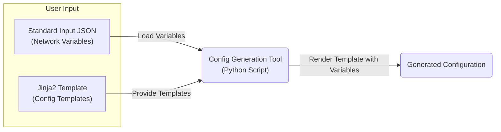
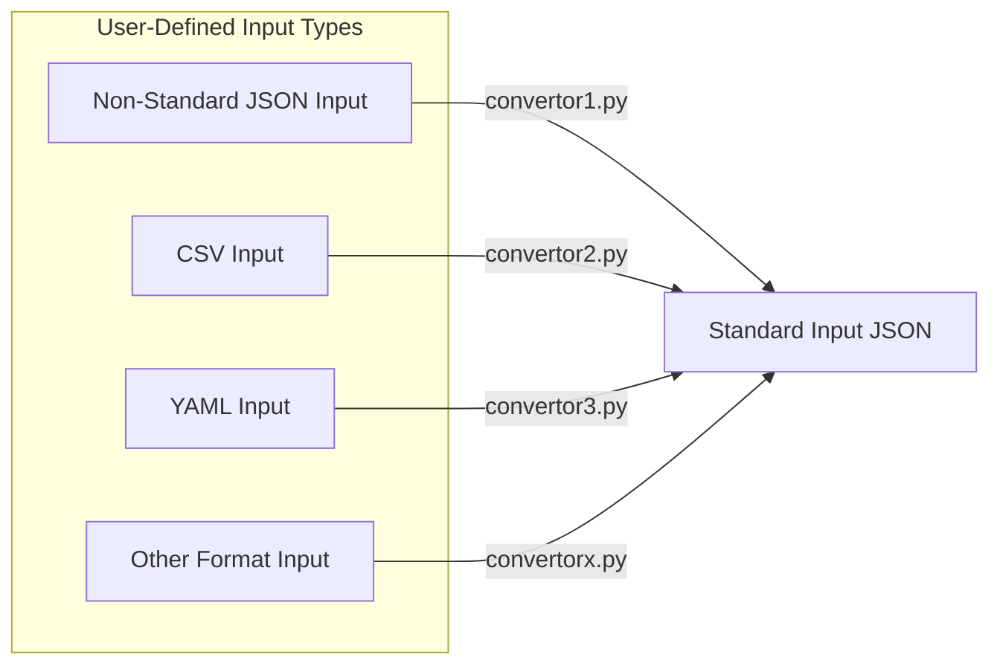
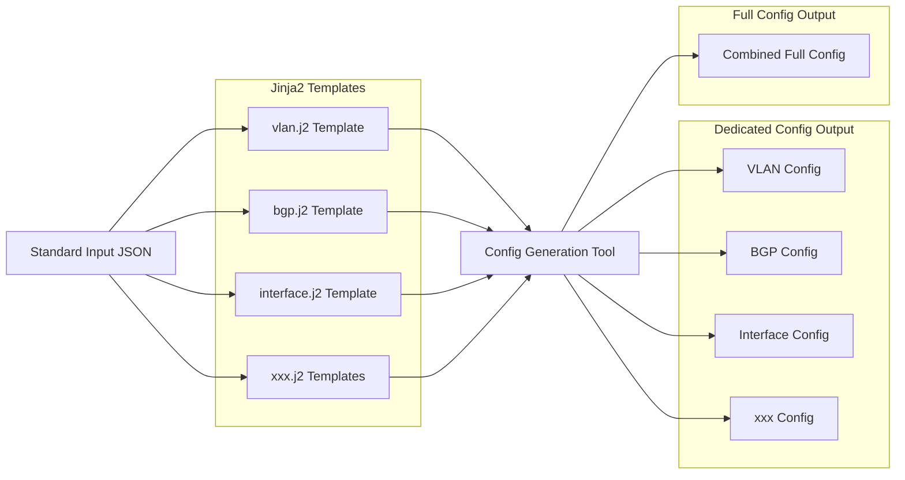

# Network Configuration Generation Tool

- [Network Configuration Generation Tool](#network-configuration-generation-tool)
  - [Overview](#overview)
  - [Quick Navigation](#quick-navigation)
  - [Goals](#goals)
  - [Design Architecture](#design-architecture)
    - [Overall Flow](#overall-flow)
    - [Other User-Defined Input Support](#other-user-defined-input-support)
    - [Workflow Detail](#workflow-detail)
  - [Directory Structure](#directory-structure)
  - [Input \& Output Examples](#input--output-examples)
    - [Sample Input JSON](#sample-input-json)
    - [Sample Template (Jinja2)](#sample-template-jinja2)
  - [Quick Start](#quick-start)
  - [What's Improved in This Version](#whats-improved-in-this-version)
    - [Key Enhancements](#key-enhancements)

## Overview

This tool generates vendor-specific network switch configurations (e.g., Cisco NX-OS, Dell OS10) using JSON input and Jinja2 templates. It supports both source code usage and standalone executables for environments without Python.

## Quick Navigation

**First time here?** Choose your path:

- **Just want to use it?** → [`docs/QUICK_START.md`](docs/QUICK_START.md)
- **Need to convert your data format?** → [`docs/CONVERTOR_GUIDE.md`](docs/CONVERTOR_GUIDE.md)  
- **Want to customize templates?** → [`docs/TEMPLATE_GUIDE.md`](docs/TEMPLATE_GUIDE.md)
- **Need to create/modify switch templates?** → [`docs/SWITCH_INTERFACE_TEMPLATE.md`](docs/SWITCH_INTERFACE_TEMPLATE.md)
- **Having issues?** → [`docs/TROUBLESHOOTING.md`](docs/TROUBLESHOOTING.md)

---

## Goals

- Support configuration generation for **multiple switch vendors**
- Allow users to define **input variables** in a structured JSON format
- Output readable **vendor-specific configuration files**
- Support both **source-code use and standalone executable**
- Ensure clean project structure and developer scalability

---

## Design Architecture

### Overall Flow


> [!NOTE]  
> The structure and format of the **JSON input file must remain fixed** to match the variables used in the Jinja2 templates, but you can safely update **values** as needed, either manually or programmatically.

### Other User-Defined Input Support

To support a wide range of input data formats, the system allows users to define their own converters. These converters transform any non-standard input into a unified JSON structure. Sample converters are provided in the repository as references to help users get started.



Each input type should be handled by a user-defined converter script (e.g., convertor1.py). These scripts are responsible for converting the input into the standardized JSON format. Example converter scripts are included in the repo to illustrate expected structure and behavior.

### Workflow Detail


## Directory Structure

```plaintext
root/
├── .devcontainer/                  # Development container configuration
├── .github/                        # GitHub Actions workflows
├── build/                          # Build artifacts and executables
├── docs/                           # Documentation files
│   ├── CONVERTOR_GUIDE.md          # Guide for creating custom convertors
│   ├── QUICK_START.md              # Quick start and executable usage guide
│   ├── SWITCH_INTERFACE_TEMPLATE.md # Switch interface template guide
│   ├── TEMPLATE_GUIDE.md           # Jinja2 template development guide
│   └── TROUBLESHOOTING.md          # Common issues and solutions
├── input/                          # Input files and templates
│   ├── standard_input.json         # Standard format input example
│   ├── jinja2_templates/           # Jinja2 template files
│   │   ├── cisco/
│   │   │   └── nxos/               # Cisco NX-OS templates
│   │   │       ├── bgp.j2          # BGP configuration template
│   │   │       ├── full_config.j2  # Combined full configuration template
│   │   │       ├── interface.j2    # Interface configuration template
│   │   │       ├── login.j2        # Login/user configuration template
│   │   │       ├── port_channel.j2 # Port channel configuration template
│   │   │       ├── prefix_list.j2  # Prefix list configuration template
│   │   │       ├── qos.j2          # QoS configuration template
│   │   │       ├── system.j2       # System configuration template
│   │   │       └── vlan.j2         # VLAN configuration template
│   │   └── dellemc/                # Dell EMC templates (vendor-specific)
│   └── switch_interface_templates/ # Switch interface template configurations
│       ├── cisco/
│       └── dellemc/
├── src/                            # Source code
│   ├── __init__.py                 # Package initialization
│   ├── main.py                     # Entry point for the tool
│   ├── generator.py                # Main generation logic
│   ├── loader.py                   # Input file loading and parsing
│   └── convertors/                 # Input format converters
│       ├── __init__.py             # Convertor registry
│       ├── convertors_lab_switch_json.py   # Lab format converter
│       └── convertors_bmc_switch_json.py   # BMC switch converter
├── tests/                          # Test files
│   ├── test_generator.py           # Unit tests for generator logic
│   ├── test_convertors.py          # Unit tests for input conversion
│   └── test_cases/                 # Test case data files
├── requirements.txt                # Python dependencies
├── network_config_generator.spec   # PyInstaller build specification
└── _old/                           # Legacy Go implementation (archived)
```

---

## Input & Output Examples

### Sample Input JSON
```json
{
  "hostname": "tor-switch-1",
  "interfaces": [
    { "name": "Ethernet1/1", "vlan": 711, "description": "Compute1" }
  ],
  "vlans": [
    { "id": 711, "name": "Compute" }
  ],
  "bgp": {
    "asn": 65001,
    "router_id": "192.168.0.1"
  }
}
```

### Sample Template (Jinja2)
```jinja2
router bgp {{ bgp.asn }}
  router-id {{ bgp.router_id }}
```

> [!NOTE]
> **Need more details?** See [`docs/TEMPLATE_GUIDE.md`](docs/TEMPLATE_GUIDE.md) for complete examples and template development guide.

---

## Quick Start

For detailed usage instructions, examples, and setup steps, see [`docs/QUICK_START.md`](docs/QUICK_START.md).

---

## What's Improved in This Version

We've significantly redesigned the tool architecture to make it more modular, maintainable, and user-friendly. While the original version used **Go templates**, the new version is built with **Python + Jinja2** and brings several key improvements:

### Key Enhancements

- **Modular Output Generation**  
  Instead of producing a single full configuration, the tool now supports generating individual configuration sections (e.g., VLANs, interfaces, BGP) based on your input needs—making review, debugging, and reuse much easier.

- **No Rebuild Required for Changes**  
  All logic is now in editable Python and Jinja2 templates—no compilation needed. You can easily update the templates or logic without rebuilding any binary.

- **Cleaner and More Flexible Logic**  
  We've removed hardcoded rules and added more structured parsing logic, which makes the tool easier to extend, test, and adapt to different network designs or vendors.

- **Open to Contributions**  
  The new structure makes it easy for contributors to add new templates or enhance existing ones. If you support a new vendor or configuration style, you can simply submit a template pull request.

This upgrade is not just a technology shift—it's a foundation for faster iteration, better collaboration, and easier maintenance.
