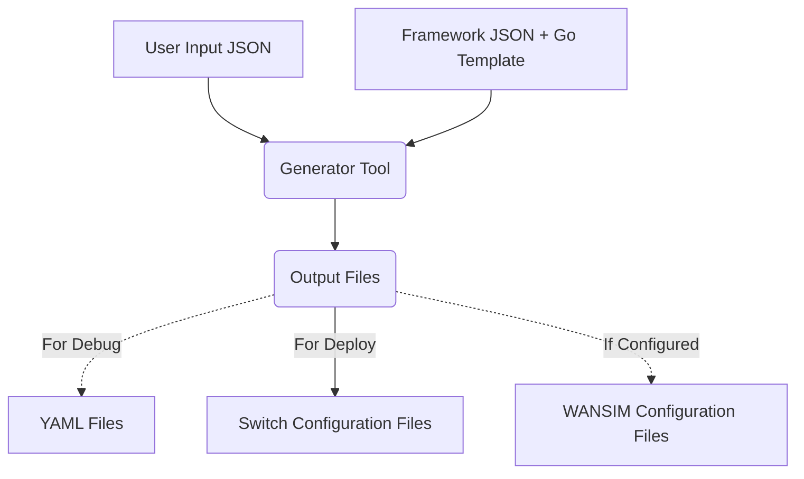

# Azure Stack Switch Config Generator

## Project Overview

### Background

This is a tool to generate network switch deployment configuration for Azure Stack, which:

- Offers Network Switch Deployment Automation to Deployment Engineer
- Supports Multiple Azure Stack Network Design Use Cases by Customized Input Template Variables.

### Workflow

## Project Design

- [User Input JSON](docs/User_Input_Json.md)

- [Customized SwitchLib](docs/Customized_SwitchLib.md)

## Get Start

- [Quick Start](docs/Quick_Start.md)

### Preparation

### Use Cases

- [Generate Vlan Configuration](docs/Generate_Vlan_Config.md)
- [Understand AzureStackWANSimulator](https://github.com/microsoft/AzureStackWANSimulator)
