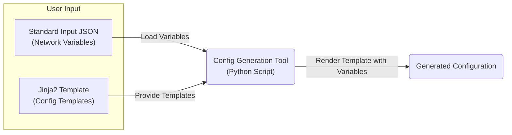
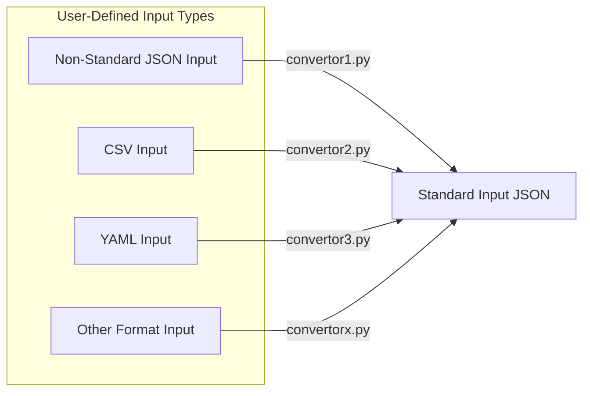
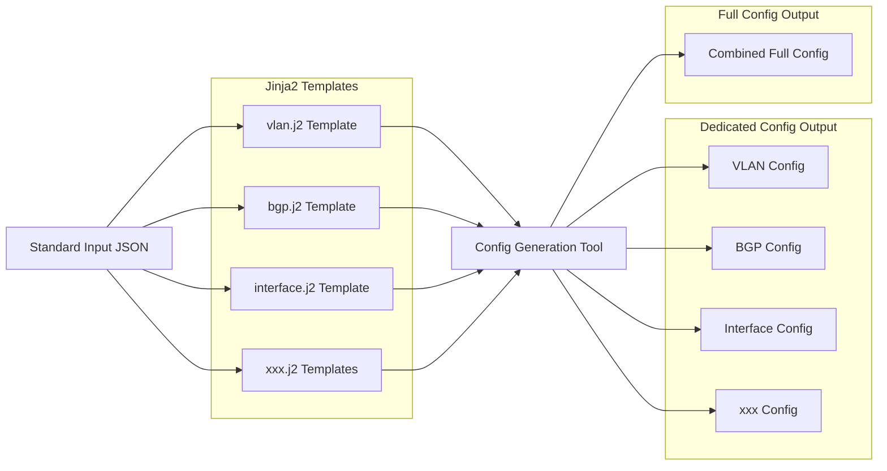

# Network Configuration Generation Tool

## 📘 Overview

This tool aims to generate vendor-specific network switch configurations (e.g., Cisco NX-OS, Dell OS10) using JSON input and Jinja2 templates. It supports optional packaging for environments where Python is not pre-installed.

---

## 🎯 Goals

- Support configuration generation for **multiple switch vendors**
- Allow users to define **input variables** in a structured JSON format
- Output readable **vendor-specific configuration files**
- Support both **source-code use and standalone executable**
- Ensure clean project structure and developer scalability

---

## 🧱 Design Architecture

### Overall Flow


> **Note:**  
> The structure and format of the **JSON input file must remain fixed** to match the variables used in the Jinja2 templates, but you can safely update **values** as needed, either manually or programmatically.

#### Other User-Defined Input Support

To support a wide range of input data formats, the system allows users to define their own converters. These converters transform any non-standard input into a unified JSON structure. Sample converters are provided in the repository as references to help users get started.


Each input type should be handled by a user-defined converter script (e.g., convertor1.py). These scripts are responsible for converting the input into the standardized JSON format. Example converter scripts are included in the repo to illustrate expected structure and behavior.


### Workflow Detail



## 🗂️ Directory Structure

```plaintext
root/
├── docs/
│   └── architecture.md             # Design documentation
├── input/
│   ├── standard_input.json         # Standard input file
│   └── templates/
│       └── cisco/
│           └── nxos/
│               ├── full_config.j2           # Merge all templates into one
│               ├── feature1.j2              # Default feature template
│               ├── feature2.j2
│               ├── system.j2
│               └── 10/                      # NX-OS version 10 specific templates
│                   ├── version_feature1.j2  # Versioned feature template
│                   └── version_system.j2    # Versioned system template
├── src/
│   ├── __init__.py
│   ├── convertor.py                # Converts various input formats
│   ├── generator.py                # Main generation logic
│   └── loader.py                   # Loads and parses input
├── tests/
│   ├── test_generator.py          # Unit tests for generator logic
│   ├── test_convertors.py         # Unit tests for input conversion
│   ├── test_cases/
│   │   ├── convert_switch_input_json/
│   │   │   └── convert_switch_input.json
│   │   ├── std_nxos_hyperconverged/
│   │   │   └── std_nxos_hyperconverged_input.json
│   │   ├── std_nxos_switched/
│   │   │   └── std_nxos_switched_input.json
│   │
├── requirements.txt               # Python dependencies

```

---

## 🔧 Input (Example)

### Standard Input JSON (Example)
```json
{
  "hostname": "tor-switch-1",
  "interfaces": [
    { "name": "Ethernet1/1", "vlan": 711, "description": "Compute1" },
    { "name": "Ethernet1/2", "vlan": 712, "description": "Storage1" }
  ],
  "vlans": [
    { "id": 711, "name": "Compute" },
    { "id": 712, "name": "Storage" }
  ],
  "bgp": {
    "asn": 65001,
    "router_id": "192.168.0.1",
    "neighbors": [
      { "ip": "192.168.0.2", "remote_as": 65002 }
    ]
  }
}
```

---

### Input Jinja2 Template (Example)

Example: `templates/nxos/bgp.j2`

```jinja2
router bgp {{ bgp.asn }}
  router-id {{ bgp.router_id }}

  neighbor {{ neighbor.ip }}
    remote-as {{ neighbor.remote_as }}

```

---


## 🛠️ Why We Switched: Go Templates → Python + Jinja2

We initially used **Golang + Go Templates** to generate switch configurations. It worked, but we found some limitations as the project grew. Now, we’ve switched to **Python + Jinja2** for better flexibility and maintainability.

### 🔍 Comparison Table

| Feature                        | Go + Go Templates                   | Python + Jinja2                         |
|-------------------------------|-------------------------------------|-----------------------------------------|
| Templating Features           | Basic, minimal logic                | Powerful logic, filters, macros         |
| Community & Ecosystem         | Smaller for templates               | Large and well-supported                |
| Config File Support           | Manual parsing needed               | Native support for JSON, YAML, TOML     |
| Customer Customization        | Needs Go rebuild                    | Just edit input files or templates      |
| Packaging                     | `go build` (simple binary)          | `pyinstaller` (self-contained app)      |


This change helps us move faster, reduce complexity, and make the tool more user-friendly.

