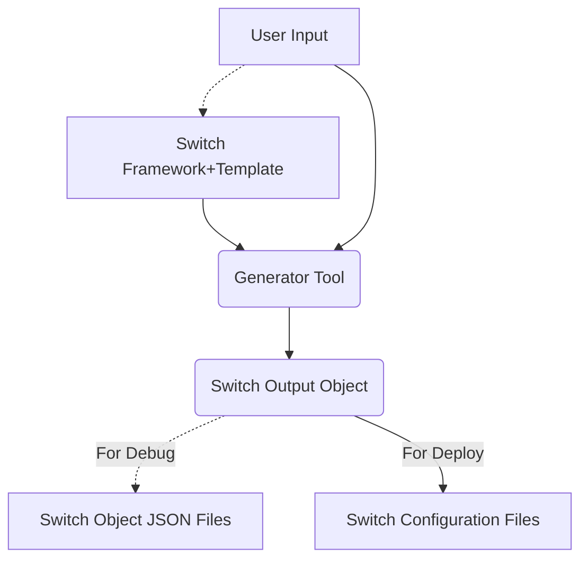
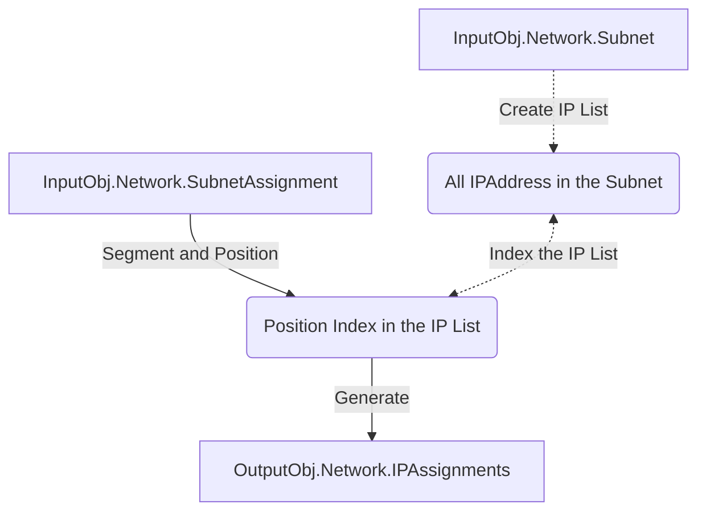
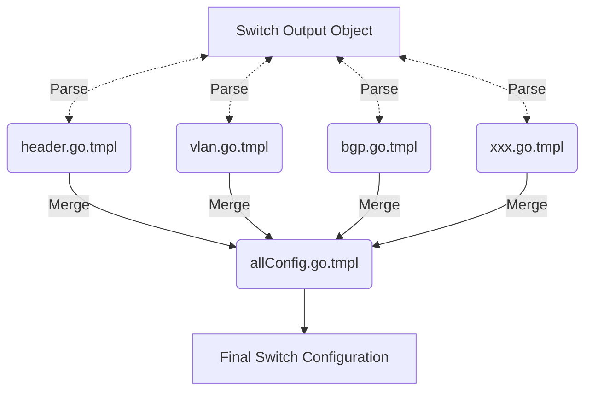

# Switch Configuration Generator

- [Switch Configuration Generator](#switch-configuration-generator)
  - [Project Design](#project-design)
    - [Overall Design](#overall-design)
      - [Logic Diagram](#logic-diagram)
      - [Resource Hierachy](#resource-hierachy)
    - [User Input Design](#user-input-design)
      - [Code Structure](#code-structure)
    - [Switch Framework and Template](#switch-framework-and-template)
    - [Switch JSON Object](#switch-json-object)
      - [Output Object Model](#output-object-model)
      - [IP Caculator Logic of Network Assignment](#ip-caculator-logic-of-network-assignment)
        - [Logic Diagram](#logic-diagram-1)
          - [Segment and Position Logic](#segment-and-position-logic)
    - [Switch Configuration Files](#switch-configuration-files)
      - [Logic Diagram](#logic-diagram-2)
      - [Template Structure](#template-structure)
  - [Concerns and Thoughts](#concerns-and-thoughts)
  - [MileStone Plan](#milestone-plan)

## Project Design

### Overall Design

#### Logic Diagram



#### Resource Hierachy

Example:

```
.
├── input
│   ├── cisco
│   │   └── 93180yc-fx
│   │       └── 9.3
│   │           ├── framework
│   │           │   ├── interface.json
│   │           │   ├── ntp.json
│   │           │   └── routing.json
│   │           └── template
│   │               ├── allConfig.go.tmpl
│   │               ├── bgp.go.tmpl
│   │               ├── header.go.tmpl
│   │               ├── inBandPort.go.tmpl
│   │               └── vlan.go.tmpl
│   ├── dell
│   │   └── s3048-on
│   │       ├── os10
│   │       │   ├── framework
│   │       │   └── template
│   │       └── os9
│   └── input.json
├── output
│   ├── S31R28-TOR1.config
│   ├── S31R28-TOR1.json
│   ├── S31R28-TOR2.config
│   ├── S31R28-TOR2.json
│   └── tor1.conf
└── src
    ├── go.mod
    ├── go.sum
    ├── inbandport.go
    ├── ipcaculator.go
    ├── ipcaculator_test.go
    ├── main.go
    ├── output.go
    ├── routing.go
    ├── strcture.go
    ├── SwitchConfigGenerator
    ├── testcases
    │   ├── input1.json
    │   ├── input2.json
    │   ├── result1.json
    │   └── result2.json
    └── vlan.go
```

### User Input Design

#### Code Structure

- Device : Switches used in the Deployment
- Network : Required network variables user defined
- External : Optional network variables user defined

```Go
type InputType struct {
	External []struct {
		Type string   `json:"Type"`
		IP   []string `json:"IP"`
	} `json:"External"`
	Device []struct {
		Make                 string `json:"Make"`
		Type                 string `json:"Type"`
		Asn                  int    `json:"ASN"`
		Hostname             string `json:"Hostname"`
		Model                string `json:"Model"`
		Firmware             string `json:"Firmware"`
		GenerateDeviceConfig bool   `json:"GenerateDeviceConfig"`
	} `json:"Device"`
	Network []struct {
		VlanID           int           `json:"VlanID"`
		Type             string        `json:"Type"`
		Name             string        `json:"Name"`
		Subnet           string        `json:"Subnet"`
		Shutdown         bool          `json:"Shutdown"`
		SubnetAssignment []interface{} `json:"SubnetAssignment"`
	} `json:"Network"`
}
```

### Switch Framework and Template

This part is the core of the project. Each switch need to have paired `framework` and `template` files to be able generate configuration accordingly.

### Switch JSON Object

#### Output Object Model

```Go
type OutputType struct {
	Device struct {
		Make                 string `json:"Make"`
		Type                 string `json:"Type"`
		Asn                  int    `json:"ASN"`
		Hostname             string `json:"Hostname"`
		Model                string `json:"Model"`
		Firmware             string `json:"Firmware"`
		GenerateDeviceConfig bool   `json:"GenerateDeviceConfig"`
	} `json:"Device"`
	Port []struct {
		Port        string `json:"Port"`
		PortName    string `json:"PortName"`
		PortType    string `json:"PortType"`
		Description string `json:"Description"`
		Mtu         int    `json:"MTU"`
		Shutdown    bool   `json:"Shutdown"`
		IPAddress   string `json:"IPAddress"`
		UntagVlan   int    `json:"UntagVlan"`
		TagVlan     []int  `json:"TagVlan"`
	} `json:"Port"`
	Vlan []struct {
		VlanName  string `json:"VlanName"`
		VlanID    int    `json:"VlanID"`
		Type      string `json:"Type"`
		IPAddress string `json:"IPAddress"`
		Mtu       int    `json:"MTU"`
		Shutdown  bool   `json:"Shutdown"`
	} `json:"Vlan"`
	Routing struct {
		Router struct {
			Bgp struct {
				BGPAsn                 int      `json:"BGPAsn"`
				RouterID               string   `json:"RouterID"`
				IPv4Network            []string `json:"IPv4Network"`
				EnableDefaultOriginate bool     `json:"EnableDefaultOriginate"`
				RoutePrefix            struct {
					MaxiPrefix  int    `json:"MaxiPrefix"`
					ErrorAction string `json:"ErrorAction"`
				} `json:"RoutePrefix"`
				IPv4Neighbor []struct {
					Description       string `json:"Description"`
					EnablePassword    bool   `json:"EnablePassword"`
					NeighborAsn       string `json:"NeighborAsn"`
					NeighborIPAddress string `json:"NeighborIPAddress"`
					PrefixList        []struct {
						Name      string `json:"Name"`
						Direction string `json:"Direction"`
					} `json:"PrefixList"`
					RouteMap []struct {
						Name      string `json:"Name"`
						Direction string `json:"Direction"`
					} `json:"RouteMap"`
					UpdateSource string `json:"UpdateSource"`
					Shutdown     bool   `json:"Shutdown"`
				} `json:"IPv4Neighbor"`
			} `json:"BGP"`
			Static interface{} `json:"Static"`
		} `json:"Router"`
		PrefixList []struct {
			Index     int    `json:"Index"`
			Name      string `json:"Name"`
			Permit    bool   `json:"Permit"`
			Network   string `json:"Network"`
			Operation string `json:"Operation"`
			Prefix    int    `json:"Prefix"`
		} `json:"PrefixList"`
		RouteMap interface{} `json:"RouteMap"`
	} `json:"Routing"`
	Network []struct {
		VlanID       int           `json:"VlanID"`
		Type         string        `json:"Type"`
		Name         string        `json:"Name"`
		Subnet       string        `json:"Subnet"`
		Shutdown     bool          `json:"Shutdown"`
		IPAssignment []interface{} `json:"IPAssignment"`
	} `json:"Network"`
}
```

#### IP Caculator Logic of Network Assignment

##### Logic Diagram



###### Segment and Position Logic

The IP Assignment will be sorted by assigned netmask in **descend order** and then assigned by assgined position.
Example:

- Given Input:

```json
{
  "VlanID": null,
  "Type": "IP",
  "Name": "SwitchMgmt",
  "Subnet": "192.168.1.0/28",
  "Shutdown": false,
  "SubnetAssignment": [
    {
      "Name": "P2P_TOR1_To_Border1",
      "Netmask": 31,
      "IPSize": 2,
      "IPAssignment": [
        {
          "Name": "TOR1_Loopback0",
          "Netmask": 32,
          "IPSize": 1,
          "IPAssignment": [
            {
              "Name": "TOR1_Loopback0",
              "Position": 0
            }
          ]
        },
        {
          "Name": "P2P_TOR1_To_Border1",
          "Netmask": 31,
          "IPSize": 2,
          "IPAssignment": [
            {
              "Name": "TOR1",
              "Position": 0
            },
            {
              "Name": "Border1",
              "Position": 1
            }
          ]
        }
      ]
    }
  ]
}
```

- Get Output:

```json
{
  "VlanID": 0,
  "Type": "IP",
  "Name": "SwitchMgmt",
  "Subnet": "192.168.1.0/28",
  "Shutdown": false,
  "IPAssignment": [
    {
      "Name": "P2P_TOR1_To_Border1/TOR1",
      "IPAddress": "192.168.1.0/31"
    },
    {
      "Name": "P2P_TOR1_To_Border1/Border1",
      "IPAddress": "192.168.1.1/31"
    },
    {
      "Name": "TOR1_Loopback0/TOR1_Loopback0",
      "IPAddress": "192.168.1.2/32"
    }
  ]
}
```

### Switch Configuration Files

Switch configuration is generated by using Go native package: [text/template](https://pkg.go.dev/text/template)

#### Logic Diagram



#### Template Structure

| Config     | Template           | Source                       |
| ---------- | ------------------ | ---------------------------- |
| All Config | allConfig.go.tmpl  | All templates below          |
| Header     | header.go.tmpl     | OutputObj.Device             |
| VLAN       | vlan.go.tmpl       | OutputObj.Vlan               |
| InBandPort | inBandPort.go.tmpl | OutputObj.Port               |
| BGP        | bgp.go.tmpl        | OutputObj.Routing.Router.Bgp |

## Concerns and Thoughts

- Current functions heavily depend on given name.

  - Example: In input.json file, all vlan name has to be matched exact with related framework file.
  - Thoughts: We can define/hardcode what we want right now. However, use pre-defined portal/webpage? Bring more unecessary maintain or could reduce confusion?

- Due to different deploy pattern, the tool is very fragile and complex to maintain.

  - Thoughts: Do Not try to cover all the use cases, focus on the major(70%) customer deploy scenario, and make it reliable with well documentation. Then leave rest 30% manual modify if need at this moment.

## MileStone Plan

- POC Phase - 06/24

  - Existing documentation
  - Unit Test
  - Optimize/Comment current code

- Testing on Single Switch Validation Virtual (GNS3 Lab) - 08/19

  - Cisco switch existing configuration operate
  - Add `OutOfBandPort`,`Credential`,`Stig_Setting`,`PrefixList`,`PolicyMap`,`NTP`,`STP`,`VTY`, `Static`,`Syslog`
  - Complete `Unused` Port in `interface.json` framework

- Testing on Multi-Switch Validation Virtual (GNS3 Lab) - 09/16

  - Add `Port-Channel`,`MLAG`
  - Define BMC Framework
  - BMC Cisco Switch Integration

- Physical Device Testing - 09/30

  - Single Switch
  - Multi-Switch
  - CI/CD for Lab
  - Documentation
  - Lab team training
