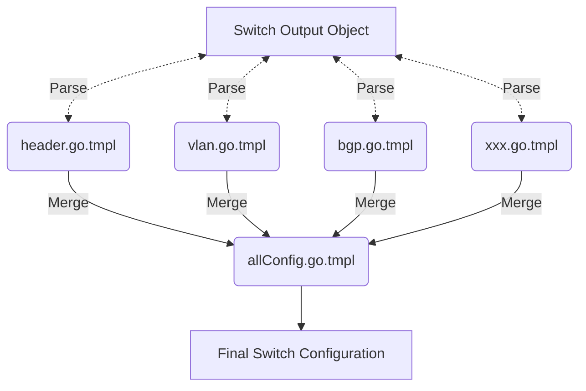

### Switch Framework and Template

This part is the core of the project. Each switch need to have paired `framework` and `template` files to be able generate configuration accordingly.

### Switch Configuration Files

Switch configuration is generated by using Go native package: [text/template](https://pkg.go.dev/text/template)

#### Logic Diagram

#### Template Structure

| Config     | Template           | Source                       |
| ---------- | ------------------ | ---------------------------- |
| All Config | allConfig.go.tmpl  | All templates below          |
| Header     | header.go.tmpl     | OutputObj.Device             |
| VLAN       | vlan.go.tmpl       | OutputObj.Vlan               |
| InBandPort | inBandPort.go.tmpl | OutputObj.Port               |
| BGP        | bgp.go.tmpl        | OutputObj.Routing.Router.Bgp |
