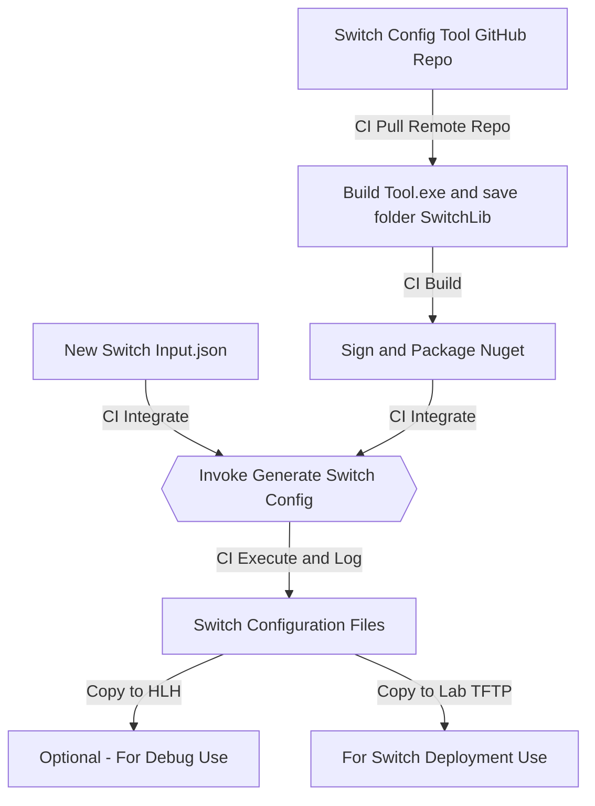

# Add Config Gen Tool to CI

## Overall Design Flow

### MileStone1: Generate the Config in CI

- Define the Switch input files with Tools and manually generated to make sure the configuration is accurate.
- Figure out where to put the tool as well as input.json file on CI.
- Update the CI script to trigger the tool run

### MileStone2: Push the configuration to the Switch and validate

