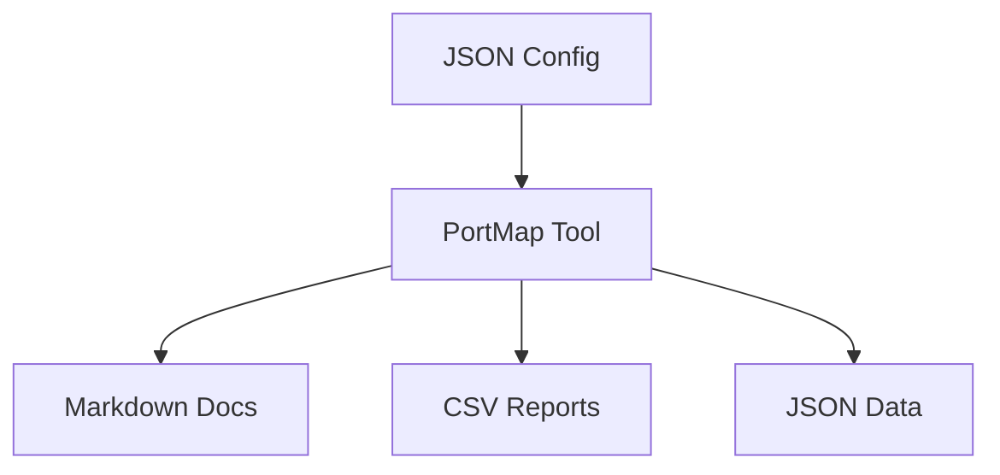
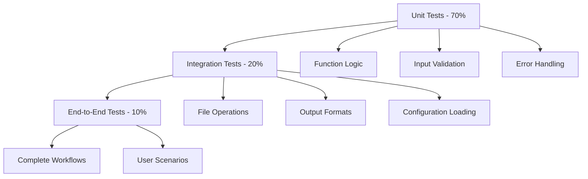
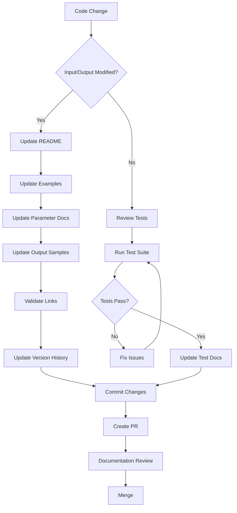

# 🤖 GitHub Copilot Agent Development Guide

[](https://docs.microsoft.com/en-us/powershell/)
[](https://docs.python.org/)
[](https://docs.microsoft.com/en-us/security/)
[](https://docs.github.com/en/get-started/writing-on-github)
[](https://pester.dev/)
[](https://jinja.palletsprojects.com/)

## 📋 Table of Contents

- [🤖 GitHub Copilot Agent Development Guide](#-github-copilot-agent-development-guide)
  - [📋 Table of Contents](#-table-of-contents)
  - [📖 Overview](#-overview)
    - [🏗️ Project Architecture](#️-project-architecture)
  - [🔐 PowerShell Security Best Practices](#-powershell-security-best-practices)
    - [⚡ Core Security Principles](#-core-security-principles)
      - [1. **Principle of Least Privilege**](#1-principle-of-least-privilege)
      - [2. **Input Validation First**](#2-input-validation-first)
      - [3. **Secure File Operations**](#3-secure-file-operations)
    - [🛡️ Input Validation \& Sanitization](#️-input-validation--sanitization)
    - [🔒 Credential Management](#-credential-management)
    - [📝 Logging \& Auditing](#-logging--auditing)
  - [💻 PowerShell Development Best Practices](#-powershell-development-best-practices)
    - [🏗️ Code Structure \& Organization](#️-code-structure--organization)
      - [**Function Design Principles**](#function-design-principles)
    - [📚 Documentation Standards](#-documentation-standards)
      - [**Comment-Based Help Requirements**](#comment-based-help-requirements)
    - [🔧 Error Handling](#-error-handling)
      - [**Comprehensive Error Management**](#comprehensive-error-management)
    - [⚡ Performance Guidelines](#-performance-guidelines)
  - [� Python Development Best Practices](#-python-development-best-practices)
    - [🔐 Python Security Best Practices](#-python-security-best-practices)
      - [**Input Validation \& Sanitization**](#input-validation--sanitization)
      - [**Secure File Operations**](#secure-file-operations)
    - [🏗️ Code Structure \& Organization](#️-code-structure--organization-1)
      - [**Module Design Principles**](#module-design-principles)
    - [🧪 Python Testing Framework](#-python-testing-framework)
      - [**pytest Configuration**](#pytest-configuration)
      - [**Comprehensive Test Suite**](#comprehensive-test-suite)
    - [📦 Python Dependency Management](#-python-dependency-management)
      - [**requirements.txt Best Practices**](#requirementstxt-best-practices)
      - [**Setup Configuration (setup.py or pyproject.toml)**](#setup-configuration-setuppy-or-pyprojecttoml)
  - [📖 GitHub Markdown Best Practices](#-github-markdown-best-practices)
    - [📊 Document Structure](#-document-structure)
      - [**Standardized README Structure**](#standardized-readme-structure)
    - [🎨 Visual Elements](#-visual-elements)
      - [**Strategic Emoji Usage**](#strategic-emoji-usage)
      - [**Enhanced Code Blocks**](#enhanced-code-blocks)
      - [**Callout Boxes**](#callout-boxes)
    - [🔗 Linking \& Navigation](#-linking--navigation)
      - [**Internal Linking Best Practices**](#internal-linking-best-practices)
    - [📱 GitHub-Specific Features](#-github-specific-features)
      - [**Collapsible Sections**](#collapsible-sections)
      - [**Mermaid Diagrams**](#mermaid-diagrams)
      - [**Task Lists**](#task-lists)
      - [**Tables with Alignment**](#tables-with-alignment)
  - [🧪 Unit Testing Framework](#-unit-testing-framework)
    - [🎯 Testing Strategy](#-testing-strategy)
      - [**Test Pyramid Architecture**](#test-pyramid-architecture)
    - [🔬 Test Implementation](#-test-implementation)
      - [**Comprehensive Test Structure**](#comprehensive-test-structure)
    - [📊 Coverage Requirements](#-coverage-requirements)
      - [**Test Coverage Standards**](#test-coverage-standards)
    - [🚀 Continuous Integration](#-continuous-integration)
      - [**GitHub Actions Integration**](#github-actions-integration)
  - [📚 Documentation Maintenance](#-documentation-maintenance)
    - [🔄 Change Management Process](#-change-management-process)
      - [**Documentation Update Workflow**](#documentation-update-workflow)
    - [📝 Documentation Standards](#-documentation-standards-1)
      - [**Automated Documentation Validation**](#automated-documentation-validation)
    - [🔍 Review Guidelines](#-review-guidelines)
      - [**Documentation Review Checklist**](#documentation-review-checklist)
    - [🤖 Automation](#-automation)
      - [**Documentation Update Scripts**](#documentation-update-scripts)
  - [🛠️ Tool-Specific Guidelines](#️-tool-specific-guidelines)
    - [**PortMap Tool Maintenance**](#portmap-tool-maintenance)
      - [**Input Format Changes**](#input-format-changes)
      - [**Output Format Changes**](#output-format-changes)
      - [**Feature Additions**](#feature-additions)
      - [**Breaking Changes**](#breaking-changes)
    - [**Python Core Generator Maintenance**](#python-core-generator-maintenance)
      - [**Input Schema Changes**](#input-schema-changes)
      - [**Template Changes**](#template-changes)
      - [**Switch Configuration Output Changes**](#switch-configuration-output-changes)
      - [**Dependency Updates**](#dependency-updates)
      - [**API Changes**](#api-changes)
      - [**Performance Optimizations**](#performance-optimizations)
    - [**Cross-Language Integration**](#cross-language-integration)
      - [**Data Format Compatibility**](#data-format-compatibility)
      - [**Documentation Synchronization**](#documentation-synchronization)
  - [📞 Support \& Resources](#-support--resources)
    - [**Documentation Resources**](#documentation-resources)
    - [**Internal Resources**](#internal-resources)
    - [**Community \& Support**](#community--support)

## 📖 Overview

This guide provides comprehensive best practices for developing and maintaining **multi-language tools** with GitHub Copilot agents, focusing on the **AzureStack Network Switch Config Generator** project ecosystem. The project consists of both **Python core components** (network configuration generation) and **PowerShell utilities** (network documentation and tooling). It covers security, development standards, documentation practices, and maintenance procedures for both languages.

> 🎯 **Goal**: Ensure consistent, secure, and well-documented Python and PowerShell tools that integrate seamlessly with GitHub workflows and maintain high quality standards.

### 🏗️ Project Architecture

```mermaid
graph TD
    A[JSON Input] --> B[Python Core - src/]
    B --> C[Jinja2 Templates]
    C --> D[Switch Configurations]

    A --> E[PowerShell Tools - tools/]
    E --> F[Port Documentation]
    E --> G[IP Management]
    E --> H[Environment Assignment]

    style B fill:#3776ab
    style E fill:#012456
```



| Component             | Language      | Purpose                                 | Location                             |
| --------------------- | ------------- | --------------------------------------- | ------------------------------------ |
| **Core Generator**    | 🐍 Python     | Network switch configuration generation | `src/`                               |
| **PortMap Tool**      | 💻 PowerShell | Physical port documentation             | `tools/PortMap/`                     |
| **IP Management**     | 💻 PowerShell | IP address assignment                   | `tools/IPAssignment/`                |
| **Environment Tools** | 💻 PowerShell | Environment configuration               | `tools/EnvironmentDetailAssignment/` |

## 🔐 PowerShell Security Best Practices

### ⚡ Core Security Principles

#### 1. **Principle of Least Privilege**

```powershell
# ✅ Good: Specific permissions
#Requires -Version 5.1
#Requires -Modules @{ ModuleName="Microsoft.PowerShell.Utility"; ModuleVersion="3.1.0.0" }

# ❌ Avoid: Excessive permissions
# #Requires -RunAsAdministrator (unless truly necessary)
```

#### 2. **Input Validation First**

```powershell
function Test-NetworkConfiguration {
    [CmdletBinding()]
    param(
        [Parameter(Mandatory = $true)]
        [ValidateScript({
            if (-not (Test-Path $_)) {
                throw "Configuration file not found: $_"
            }
            if ($_ -notmatch '\.json$') {
                throw "Only JSON files are supported"
            }
            return $true
        })]
        [string]$ConfigPath
    )

    # Additional runtime validation
    try {
        $config = Get-Content $ConfigPath -Raw | ConvertFrom-Json -ErrorAction Stop
    }
    catch {
        throw "Invalid JSON format in configuration file: $_"
    }
}
```

#### 3. **Secure File Operations**

```powershell
# ✅ Good: Safe path construction
$safePath = Join-Path -Path $env:TEMP -ChildPath "network-config-$(Get-Date -Format 'yyyyMMdd-HHmmss').json"

# ✅ Good: Validate output directory
$outputDir = Split-Path $OutputFile -Parent
if (-not (Test-Path $outputDir)) {
    New-Item -Path $outputDir -ItemType Directory -Force | Out-Null
}

# ❌ Avoid: Path injection vulnerabilities
# $outputPath = "$basePath\$userInput.json"  # Dangerous!
```

### 🛡️ Input Validation & Sanitization

<details>
<summary><strong>🔍 Comprehensive Input Validation Patterns</strong></summary>

```powershell
function Confirm-InputParameters {
    [CmdletBinding()]
    param(
        [Parameter(Mandatory = $true)]
        [ValidateNotNullOrEmpty()]
        [ValidateLength(1, 260)]  # Windows path length limit
        [string]$FilePath,

        [Parameter(Mandatory = $true)]
        [ValidateSet("Markdown", "CSV", "JSON", IgnoreCase = $true)]
        [string]$OutputFormat,

        [Parameter(Mandatory = $false)]
        [ValidateRange(1, 65535)]
        [int]$Port = 443,

        [Parameter(Mandatory = $false)]
        [ValidatePattern('^[a-zA-Z0-9\-._]+$')]
        [string[]]$DeviceNames
    )

    # Runtime validation
    if ($FilePath -match '[<>:"|?*]') {
        throw "Invalid characters in file path"
    }

    # File existence and readability
    if (-not (Test-Path $FilePath -PathType Leaf)) {
        throw "File not found or not accessible: $FilePath"
    }

    # JSON structure validation
    try {
        $jsonContent = Get-Content $FilePath -Raw | ConvertFrom-Json
        if (-not $jsonContent.devices) {
            throw "Required 'devices' property not found in JSON"
        }
    }
    catch {
        throw "JSON validation failed: $($_.Exception.Message)"
    }
}
```

</details>

### 🔒 Credential Management

```powershell
# ✅ Good: Secure credential handling
function Get-SecureCredential {
    [CmdletBinding()]
    param(
        [Parameter(Mandatory = $true)]
        [string]$CredentialName
    )

    # Use Windows Credential Manager or Azure Key Vault
    try {
        $credential = Get-StoredCredential -Target $CredentialName
        if (-not $credential) {
            $credential = Get-Credential -Message "Enter credentials for $CredentialName"
        }
        return $credential
    }
    catch {
        Write-Error "Failed to retrieve credentials: $_"
        return $null
    }
}

# ❌ Never do this
# $password = "hardcoded-password"  # Security violation!
# $apiKey = Read-Host "Enter API key"  # Logged in console history
```

### 📝 Logging & Auditing

```powershell
function Write-AuditLog {
    [CmdletBinding()]
    param(
        [Parameter(Mandatory = $true)]
        [ValidateSet("Info", "Warning", "Error", "Security")]
        [string]$Level,

        [Parameter(Mandatory = $true)]
        [string]$Message,

        [Parameter(Mandatory = $false)]
        [string]$Component = $MyInvocation.ScriptName
    )

    $logEntry = [PSCustomObject]@{
        Timestamp = Get-Date -Format "yyyy-MM-dd HH:mm:ss"
        Level = $Level
        Component = (Split-Path $Component -Leaf)
        User = $env:USERNAME
        Computer = $env:COMPUTERNAME
        Message = $Message
        ProcessId = $PID
    }

    # Write to Windows Event Log for security events
    if ($Level -eq "Security") {
        Write-EventLog -LogName "Application" -Source "NetworkTools" -EntryType Warning -EventId 1001 -Message $Message
    }

    # Also log to file with rotation
    $logPath = Join-Path $env:TEMP "network-tools-$(Get-Date -Format 'yyyy-MM').log"
    $logEntry | ConvertTo-Json -Compress | Add-Content $logPath
}
```

## 💻 PowerShell Development Best Practices

### 🏗️ Code Structure & Organization

#### **Function Design Principles**

```powershell
function Expand-NetworkPortRange {
    <#
    .SYNOPSIS
        Expands port range strings into individual port arrays with support for breakout interfaces.

    .DESCRIPTION
        Converts port range specifications (e.g., "1-24", "25.1-25.4") into arrays of individual
        port identifiers. Handles both standard integer ports and QSFP breakout sub-interfaces.

    .PARAMETER PortRange
        The port range string to expand. Supports formats:
        - "1-24" (standard range)
        - "25.1-25.4" (breakout range)
        - "26.1" (single breakout interface)

    .EXAMPLE
        Expand-NetworkPortRange -PortRange "1-5"
        Returns: @(1, 2, 3, 4, 5)

    .EXAMPLE
        Expand-NetworkPortRange -PortRange "25.1-25.4"
        Returns: @("25.1", "25.2", "25.3", "25.4")

    .OUTPUTS
        [Object[]] Array of port identifiers (integers for standard ports, strings for breakout)

    .NOTES
        Uses Write-Output -NoEnumerate to prevent PowerShell array enumeration issues
        with single-element arrays.
    #>
    [CmdletBinding()]
    [OutputType([Object[]])]
    param(
        [Parameter(Mandatory = $true, ValueFromPipeline = $true)]
        [ValidateNotNullOrEmpty()]
        [string]$PortRange
    )

    begin {
        Write-Verbose "Starting port range expansion"
    }

    process {
        try {
            Write-Verbose "Processing range: $PortRange"

            # Handle breakout interface ranges (e.g., "25.1-25.4")
            if ($PortRange -match '^(\d+)\.(\d+)-(\d+)\.(\d+)$') {
                $startPort = [int]$Matches[1]
                $startSub = [int]$Matches[2]
                $endPort = [int]$Matches[3]
                $endSub = [int]$Matches[4]

                # Validate range consistency
                if ($startPort -ne $endPort) {
                    throw "Breakout ranges must use the same primary interface: $PortRange"
                }

                $result = @()
                for ($sub = $startSub; $sub -le $endSub; $sub++) {
                    $result += "$startPort.$sub"
                }

                Write-Verbose "Expanded breakout range to $($result.Count) interfaces"
                Write-Output -NoEnumerate $result
                return
            }

            # Handle single breakout interface (e.g., "26.1")
            if ($PortRange -match '^\d+\.\d+$') {
                Write-Verbose "Single breakout interface: $PortRange"
                Write-Output -NoEnumerate @($PortRange)
                return
            }

            # Handle standard port ranges (e.g., "1-24")
            if ($PortRange -match '^(\d+)-(\d+)$') {
                $start = [int]$Matches[1]
                $end = [int]$Matches[2]

                if ($start -gt $end) {
                    throw "Invalid range: start port ($start) greater than end port ($end)"
                }

                $result = @($start..$end)
                Write-Verbose "Expanded standard range to $($result.Count) ports"
                Write-Output -NoEnumerate $result
                return
            }

            # Handle single standard port
            if ($PortRange -match '^\d+$') {
                $port = [int]$PortRange
                Write-Verbose "Single standard port: $port"
                Write-Output -NoEnumerate @($port)
                return
            }

            throw "Invalid port range format: $PortRange"
        }
        catch {
            Write-Error "Failed to expand port range '$PortRange': $($_.Exception.Message)"
            throw
        }
    }

    end {
        Write-Verbose "Port range expansion completed"
    }
}
```

### 📚 Documentation Standards

#### **Comment-Based Help Requirements**

Every function must include:

```powershell
<#
.SYNOPSIS
    Brief one-line description of what the function does.

.DESCRIPTION
    Detailed explanation of the function's purpose, behavior, and any important
    implementation details. Include algorithm explanations if complex.

.PARAMETER ParameterName
    Description of each parameter, including valid values, formats, and examples.

.EXAMPLE
    Provide multiple realistic examples showing different use cases.

.EXAMPLE
    Include edge cases and error scenarios where helpful.

.INPUTS
    What can be piped to this function.

.OUTPUTS
    What the function returns, including data types.

.NOTES
    Version information, author, change history, dependencies, or special considerations.

.LINK
    References to related functions, documentation, or external resources.
#>
```

### 🔧 Error Handling

#### **Comprehensive Error Management**

```powershell
function Import-NetworkConfiguration {
    [CmdletBinding()]
    param(
        [Parameter(Mandatory = $true)]
        [string]$ConfigPath
    )

    # Use try/catch with specific error handling
    try {
        # Validate file existence
        if (-not (Test-Path $ConfigPath)) {
            throw [System.IO.FileNotFoundException]::new("Configuration file not found: $ConfigPath")
        }

        # Attempt JSON parsing with detailed error context
        $jsonContent = Get-Content $ConfigPath -Raw -ErrorAction Stop
        $config = $jsonContent | ConvertFrom-Json -ErrorAction Stop

        # Business logic validation
        if (-not $config.devices -or $config.devices.Count -eq 0) {
            throw [System.ArgumentException]::new("Configuration must contain at least one device")
        }

        foreach ($device in $config.devices) {
            if (-not $device.deviceName) {
                throw [System.ArgumentException]::new("All devices must have a 'deviceName' property")
            }
        }

        Write-Verbose "Successfully imported configuration with $($config.devices.Count) devices"
        return $config
    }
    catch [System.IO.FileNotFoundException] {
        Write-Error "File access error: $($_.Exception.Message)" -Category ObjectNotFound
        throw
    }
    catch [System.ArgumentException] {
        Write-Error "Configuration validation error: $($_.Exception.Message)" -Category InvalidArgument
        throw
    }
    catch {
        # Generic JSON parsing errors
        if ($_.Exception.Message -like "*JSON*") {
            Write-Error "JSON parsing failed in '$ConfigPath'. Please verify file format and syntax." -Category InvalidData
        }
        else {
            Write-Error "Unexpected error importing configuration: $($_.Exception.Message)" -Category NotSpecified
        }
        throw
    }
}
```

### ⚡ Performance Guidelines

<details>
<summary><strong>🚀 Performance Optimization Patterns</strong></summary>

```powershell
# ✅ Good: Use efficient collections
$deviceList = [System.Collections.Generic.List[PSObject]]::new()
$connectionMap = [System.Collections.Hashtable]::new()

# ✅ Good: Minimize object creation in loops
foreach ($device in $devices) {
    $deviceList.Add([PSCustomObject]@{
        Name = $device.deviceName
        Ports = $device.portRanges | ForEach-Object { Expand-PortRange $_.range }
    })
}

# ❌ Avoid: Inefficient array operations
# $results = @()
# foreach ($item in $largeCollection) {
#     $results += $item  # Creates new array each time!
# }

# ✅ Good: Use pipeline efficiently
$processedDevices = $devices |
    Where-Object { $_.deviceType -eq 'Switch' } |
    ForEach-Object {
        [PSCustomObject]@{
            Name = $_.deviceName
            PortCount = ($_.portRanges | Measure-Object).Count
        }
    }

# ✅ Good: Parallel processing for independent operations
$results = $devices | ForEach-Object -Parallel {
    param($device)
    Process-DeviceConfiguration -Device $device
} -ThrottleLimit 10
```

</details>

## � Python Development Best Practices

### 🔐 Python Security Best Practices

#### **Input Validation & Sanitization**

```python
import json
import os
from pathlib import Path
from typing import Dict, Any, Optional
import logging

def validate_input_json(filepath: Path) -> Dict[str, Any]:
    """
    Safely load and validate JSON configuration files.

    Args:
        filepath: Path to JSON configuration file

    Returns:
        Validated configuration dictionary

    Raises:
        FileNotFoundError: If configuration file doesn't exist
        ValueError: If JSON is invalid or missing required fields
        PermissionError: If file cannot be read
    """
    # Validate file exists and is readable
    if not filepath.exists():
        raise FileNotFoundError(f"Configuration file not found: {filepath}")

    if not filepath.is_file():
        raise ValueError(f"Path is not a file: {filepath}")

    # Check file permissions
    if not os.access(filepath, os.R_OK):
        raise PermissionError(f"Cannot read file: {filepath}")

    # Validate file size (prevent DoS attacks)
    file_size = filepath.stat().st_size
    if file_size > 50 * 1024 * 1024:  # 50MB limit
        raise ValueError(f"Configuration file too large: {file_size} bytes")

    try:
        with open(filepath, 'r', encoding='utf-8') as file:
            data = json.load(file)
    except json.JSONDecodeError as e:
        raise ValueError(f"Invalid JSON format: {e}")
    except UnicodeDecodeError as e:
        raise ValueError(f"File encoding error: {e}")

    # Validate required structure
    required_fields = ['switch']
    for field in required_fields:
        if field not in data:
            raise ValueError(f"Missing required field: {field}")

    # Validate switch metadata
    switch_data = data['switch']
    switch_required = ['make', 'firmware']
    for field in switch_required:
        if field not in switch_data:
            raise ValueError(f"Missing required switch field: {field}")
        if not isinstance(switch_data[field], str) or not switch_data[field].strip():
            raise ValueError(f"Switch field '{field}' must be non-empty string")

    logging.info(f"Successfully validated configuration: {filepath}")
    return data

def sanitize_path_component(component: str) -> str:
    """
    Sanitize string for use in file paths.

    Args:
        component: String to sanitize

    Returns:
        Sanitized string safe for file paths
    """
    # Remove dangerous characters
    safe_chars = "abcdefghijklmnopqrstuvwxyzABCDEFGHIJKLMNOPQRSTUVWXYZ0123456789-_."
    sanitized = ''.join(c for c in component if c in safe_chars)

    # Prevent directory traversal
    if sanitized in ('..', '.'):
        sanitized = '_'

    # Ensure not empty
    if not sanitized:
        sanitized = 'default'

    return sanitized[:255]  # Limit length
```

#### **Secure File Operations**

```python
from pathlib import Path
import tempfile
import shutil
from contextlib import contextmanager

@contextmanager
def secure_temp_dir():
    """
    Create a secure temporary directory with proper cleanup.
    """
    temp_dir = None
    try:
        temp_dir = Path(tempfile.mkdtemp(prefix='netconfig_'))
        # Set restrictive permissions (owner only)
        temp_dir.chmod(0o700)
        yield temp_dir
    finally:
        if temp_dir and temp_dir.exists():
            shutil.rmtree(temp_dir, ignore_errors=True)

def safe_write_config(content: str, output_path: Path) -> None:
    """
    Safely write configuration content to file.

    Args:
        content: Configuration content to write
        output_path: Destination file path
    """
    # Validate output directory
    output_dir = output_path.parent
    if not output_dir.exists():
        output_dir.mkdir(parents=True, mode=0o755)

    # Use atomic write with temporary file
    temp_path = output_path.with_suffix(output_path.suffix + '.tmp')

    try:
        with open(temp_path, 'w', encoding='utf-8') as temp_file:
            temp_file.write(content)
            temp_file.flush()
            os.fsync(temp_file.fileno())  # Force write to disk

        # Atomic move
        temp_path.replace(output_path)

        # Set appropriate permissions
        output_path.chmod(0o644)

        logging.info(f"Successfully wrote configuration to: {output_path}")

    except Exception as e:
        # Cleanup on failure
        if temp_path.exists():
            temp_path.unlink()
        raise
```

### 🏗️ Code Structure & Organization

#### **Module Design Principles**

```python
"""
Network Configuration Generator Module

This module provides functionality for generating network switch configurations
from standardized JSON input using Jinja2 templates.

Example:
    Basic usage of the configuration generator:

        from generator import generate_config

        generate_config(
            input_std_json="config.json",
            template_folder="templates/",
            output_folder="output/"
        )

Attributes:
    __version__ (str): The current version of this module
    __author__ (str): Module author information
"""

__version__ = "1.0.0"
__author__ = "Network Engineering Team"

import logging
from pathlib import Path
from typing import Dict, Any, Optional
from jinja2 import Environment, FileSystemLoader, select_autoescape

# Configure module-level logging
logger = logging.getLogger(__name__)

class ConfigurationError(Exception):
    """Custom exception for configuration-related errors."""
    pass

class TemplateError(Exception):
    """Custom exception for template-related errors."""
    pass

class NetworkConfigGenerator:
    """
    Main class for generating network switch configurations.

    This class handles the entire configuration generation pipeline from
    input validation through template rendering to output file creation.

    Attributes:
        template_env: Jinja2 environment for template rendering
        output_directory: Path where generated configurations are written
    """

    def __init__(self, template_directory: Path, output_directory: Path):
        """
        Initialize the configuration generator.

        Args:
            template_directory: Path to Jinja2 templates
            output_directory: Path for output configurations

        Raises:
            FileNotFoundError: If template directory doesn't exist
            PermissionError: If directories aren't accessible
        """
        self.template_directory = Path(template_directory)
        self.output_directory = Path(output_directory)

        # Validate directories
        if not self.template_directory.exists():
            raise FileNotFoundError(f"Template directory not found: {template_directory}")

        if not self.template_directory.is_dir():
            raise ValueError(f"Template path is not a directory: {template_directory}")

        # Create output directory if it doesn't exist
        self.output_directory.mkdir(parents=True, exist_ok=True)

        # Initialize Jinja2 environment with security settings
        self.template_env = Environment(
            loader=FileSystemLoader(str(self.template_directory)),
            autoescape=select_autoescape(['html', 'xml']),
            trim_blocks=True,
            lstrip_blocks=True
        )

        logger.info(f"Initialized generator with templates: {template_directory}")

    def generate_configuration(
        self,
        config_data: Dict[str, Any],
        device_name: str
    ) -> Path:
        """
        Generate configuration for a single network device.

        Args:
            config_data: Validated configuration data dictionary
            device_name: Name of the target device

        Returns:
            Path to generated configuration file

        Raises:
            ConfigurationError: If configuration generation fails
            TemplateError: If template rendering fails
        """
        try:
            # Extract device metadata
            switch_data = config_data['switch']
            make = sanitize_path_component(switch_data['make'].lower())
            firmware = sanitize_path_component(switch_data['firmware'].lower())

            # Find appropriate template
            template_path = self._find_template(make, firmware)
            template = self.template_env.get_template(str(template_path))

            # Render configuration
            rendered_config = template.render(
                switch=switch_data,
                device_name=device_name,
                **config_data
            )

            # Generate output filename
            output_filename = f"{sanitize_path_component(device_name)}.cfg"
            output_path = self.output_directory / output_filename

            # Write configuration file
            safe_write_config(rendered_config, output_path)

            return output_path

        except Exception as e:
            logger.error(f"Failed to generate configuration for {device_name}: {e}")
            raise ConfigurationError(f"Configuration generation failed: {e}")

    def _find_template(self, make: str, firmware: str) -> Path:
        """
        Locate the appropriate template file for device make/firmware.

        Args:
            make: Device manufacturer (e.g., 'cisco', 'dell')
            firmware: Device firmware (e.g., 'nxos', 'os10')

        Returns:
            Path to template file

        Raises:
            TemplateError: If template cannot be found
        """
        # Try specific template first
        specific_template = self.template_directory / make / firmware / "full_config.j2"
        if specific_template.exists():
            return Path(make) / firmware / "full_config.j2"

        # Try generic template
        generic_template = self.template_directory / "generic" / "full_config.j2"
        if generic_template.exists():
            logger.warning(f"Using generic template for {make}/{firmware}")
            return Path("generic") / "full_config.j2"

        raise TemplateError(f"No template found for {make}/{firmware}")
```

### 🧪 Python Testing Framework

#### **pytest Configuration**

```python
# conftest.py - pytest configuration and fixtures
import pytest
from pathlib import Path
import tempfile
import shutil
import json
from typing import Dict, Any

@pytest.fixture
def temp_directory():
    """Create a temporary directory for test files."""
    temp_dir = Path(tempfile.mkdtemp())
    yield temp_dir
    shutil.rmtree(temp_dir, ignore_errors=True)

@pytest.fixture
def sample_config() -> Dict[str, Any]:
    """Provide sample configuration data for tests."""
    return {
        "switch": {
            "make": "cisco",
            "firmware": "nxos",
            "version": "9.3.8"
        },
        "interfaces": [
            {
                "name": "Ethernet1/1",
                "type": "access",
                "vlan": 100
            }
        ]
    }

@pytest.fixture
def sample_config_file(temp_directory, sample_config):
    """Create a sample JSON configuration file."""
    config_file = temp_directory / "test_config.json"
    with open(config_file, 'w') as f:
        json.dump(sample_config, f, indent=2)
    return config_file

@pytest.fixture
def template_directory(temp_directory):
    """Create a sample template directory structure."""
    template_dir = temp_directory / "templates"
    cisco_dir = template_dir / "cisco" / "nxos"
    cisco_dir.mkdir(parents=True)

    # Create sample template
    template_content = """
hostname {{ device_name }}
!

interface {{ interface.name }}
  switchport mode {{ interface.type }}
  
  switchport access vlan {{ interface.vlan }}
  
!

"""

    template_file = cisco_dir / "full_config.j2"
    template_file.write_text(template_content)

    return template_dir
```

#### **Comprehensive Test Suite**

```python
# test_generator.py - Main generator testing
import pytest
from pathlib import Path
from generator import NetworkConfigGenerator, ConfigurationError, TemplateError
from loader import validate_input_json

class TestNetworkConfigGenerator:
    """Test suite for NetworkConfigGenerator class."""

    def test_generator_initialization(self, template_directory, temp_directory):
        """Test proper generator initialization."""
        output_dir = temp_directory / "output"
        generator = NetworkConfigGenerator(template_directory, output_dir)

        assert generator.template_directory == template_directory
        assert generator.output_directory == output_dir
        assert output_dir.exists()  # Should be created automatically

    def test_generator_invalid_template_directory(self, temp_directory):
        """Test initialization with invalid template directory."""
        invalid_template_dir = temp_directory / "nonexistent"
        output_dir = temp_directory / "output"

        with pytest.raises(FileNotFoundError):
            NetworkConfigGenerator(invalid_template_dir, output_dir)

    def test_generate_configuration_success(
        self,
        template_directory,
        temp_directory,
        sample_config
    ):
        """Test successful configuration generation."""
        output_dir = temp_directory / "output"
        generator = NetworkConfigGenerator(template_directory, output_dir)

        result_path = generator.generate_configuration(sample_config, "switch01")

        assert result_path.exists()
        assert result_path.name == "switch01.cfg"

        # Verify content
        content = result_path.read_text()
        assert "hostname switch01" in content
        assert "interface Ethernet1/1" in content
        assert "switchport access vlan 100" in content

    def test_generate_configuration_missing_template(
        self,
        temp_directory,
        sample_config
    ):
        """Test configuration generation with missing template."""
        # Create empty template directory
        template_dir = temp_directory / "templates"
        template_dir.mkdir()
        output_dir = temp_directory / "output"

        generator = NetworkConfigGenerator(template_dir, output_dir)

        with pytest.raises(ConfigurationError):
            generator.generate_configuration(sample_config, "switch01")

    def test_path_sanitization(self, template_directory, temp_directory, sample_config):
        """Test that device names are properly sanitized for file paths."""
        output_dir = temp_directory / "output"
        generator = NetworkConfigGenerator(template_directory, output_dir)

        # Test with potentially dangerous device name
        dangerous_name = "../../../etc/passwd"
        result_path = generator.generate_configuration(sample_config, dangerous_name)

        # Should be sanitized to safe filename
        assert result_path.parent == output_dir
        assert ".." not in str(result_path)
        assert "passwd" not in str(result_path)

class TestInputValidation:
    """Test suite for input validation functions."""

    def test_validate_valid_config(self, sample_config_file):
        """Test validation of valid configuration file."""
        result = validate_input_json(sample_config_file)

        assert isinstance(result, dict)
        assert "switch" in result
        assert result["switch"]["make"] == "cisco"

    def test_validate_nonexistent_file(self, temp_directory):
        """Test validation of nonexistent file."""
        nonexistent_file = temp_directory / "nonexistent.json"

        with pytest.raises(FileNotFoundError):
            validate_input_json(nonexistent_file)

    def test_validate_invalid_json(self, temp_directory):
        """Test validation of invalid JSON file."""
        invalid_file = temp_directory / "invalid.json"
        invalid_file.write_text("{ invalid json content")

        with pytest.raises(ValueError, match="Invalid JSON format"):
            validate_input_json(invalid_file)

    def test_validate_missing_required_fields(self, temp_directory):
        """Test validation of JSON missing required fields."""
        incomplete_config = {"incomplete": "config"}
        config_file = temp_directory / "incomplete.json"

        with open(config_file, 'w') as f:
            json.dump(incomplete_config, f)

        with pytest.raises(ValueError, match="Missing required field"):
            validate_input_json(config_file)

    @pytest.mark.parametrize("file_size", [0, 1024, 50 * 1024 * 1024 + 1])
    def test_validate_file_size_limits(self, temp_directory, file_size):
        """Test file size validation."""
        large_file = temp_directory / "large.json"

        # Create file of specified size
        with open(large_file, 'wb') as f:
            if file_size > 0:
                f.write(b'x' * file_size)

        if file_size > 50 * 1024 * 1024:  # Over 50MB limit
            with pytest.raises(ValueError, match="Configuration file too large"):
                validate_input_json(large_file)
        elif file_size == 0:
            with pytest.raises(ValueError, match="Invalid JSON format"):
                validate_input_json(large_file)
        else:
            # Should handle normal sized files (will fail JSON parsing but not size check)
            with pytest.raises(ValueError):
                validate_input_json(large_file)

# Integration tests
class TestEndToEndGeneration:
    """End-to-end integration tests."""

    def test_full_generation_pipeline(
        self,
        template_directory,
        temp_directory,
        sample_config_file
    ):
        """Test complete generation pipeline from file to output."""
        output_dir = temp_directory / "output"

        # Load and validate configuration
        config_data = validate_input_json(sample_config_file)

        # Generate configuration
        generator = NetworkConfigGenerator(template_directory, output_dir)
        result_path = generator.generate_configuration(config_data, "test-switch")

        # Verify results
        assert result_path.exists()
        content = result_path.read_text()
        assert "hostname test-switch" in content

        # Verify file permissions
        assert oct(result_path.stat().st_mode)[-3:] == '644'
```

### 📦 Python Dependency Management

#### **requirements.txt Best Practices**

```plaintext
# Core dependencies with version pinning
jinja2>=3.1.0,<4.0.0
pytest>=7.0.0,<8.0.0

# Development dependencies
pytest-cov>=4.0.0,<5.0.0
black>=22.0.0,<24.0.0
flake8>=5.0.0,<6.0.0
mypy>=1.0.0,<2.0.0
isort>=5.0.0,<6.0.0

# Security scanning
bandit>=1.7.0,<2.0.0
safety>=2.0.0,<3.0.0
```

#### **Setup Configuration (setup.py or pyproject.toml)**

```toml
# pyproject.toml - Modern Python project configuration
[build-system]
requires = ["setuptools>=45", "wheel", "setuptools_scm>=6.2"]
build-backend = "setuptools.build_meta"

[project]
name = "azurestack-network-config-generator"
description = "Network switch configuration generator for AzureStack environments"
readme = "README.md"
authors = [{name = "Network Engineering Team"}]
license = {text = "MIT"}
classifiers = [
    "Development Status :: 4 - Beta",
    "Intended Audience :: System Administrators",
    "License :: OSI Approved :: MIT License",
    "Programming Language :: Python :: 3",
    "Programming Language :: Python :: 3.7",
    "Programming Language :: Python :: 3.8",
    "Programming Language :: Python :: 3.9",
    "Programming Language :: Python :: 3.10",
    "Programming Language :: Python :: 3.11",
]
requires-python = ">=3.7"
dependencies = [
    "jinja2>=3.1.0,<4.0.0",
]
dynamic = ["version"]

[project.optional-dependencies]
dev = [
    "pytest>=7.0.0,<8.0.0",
    "pytest-cov>=4.0.0,<5.0.0",
    "black>=22.0.0,<24.0.0",
    "flake8>=5.0.0,<6.0.0",
    "mypy>=1.0.0,<2.0.0",
    "isort>=5.0.0,<6.0.0",
    "bandit>=1.7.0,<2.0.0",
    "safety>=2.0.0,<3.0.0",
]

[project.scripts]
netconfig = "src.main:main"

[tool.setuptools_scm]
write_to = "src/_version.py"

[tool.black]
line-length = 88
target-version = ['py37', 'py38', 'py39', 'py310', 'py311']
include = '\.pyi?$'
extend-exclude = '''
/(
  # directories
  \.eggs
  | \.git
  | \.hg
  | \.mypy_cache
  | \.tox
  | \.venv
  | build
  | dist
)/
'''

[tool.isort]
profile = "black"
multi_line_output = 3
line_length = 88
known_first_party = ["src"]

[tool.mypy]
python_version = "3.7"
warn_return_any = true
warn_unused_configs = true
disallow_untyped_defs = true
disallow_incomplete_defs = true
check_untyped_defs = true
disallow_untyped_decorators = true
no_implicit_optional = true
warn_redundant_casts = true
warn_unused_ignores = true
warn_no_return = true
warn_unreachable = true
strict_equality = true

[tool.pytest.ini_options]
testpaths = ["tests"]
python_files = ["test_*.py"]
python_classes = ["Test*"]
python_functions = ["test_*"]
addopts = [
    "--verbose",
    "--cov=src",
    "--cov-report=html",
    "--cov-report=term-missing",
    "--cov-fail-under=85",
]

[tool.coverage.run]
source = ["src"]
omit = [
    "*/tests/*",
    "*/test_*.py",
    "setup.py",
]

[tool.coverage.report]
exclude_lines = [
    "pragma: no cover",
    "def __repr__",
    "if self.debug:",
    "if settings.DEBUG",
    "raise AssertionError",
    "raise NotImplementedError",
    "if 0:",
    "if __name__ == .__main__.:",
]
```

## 📖 GitHub Markdown Best Practices

### 📊 Document Structure

#### **Standardized README Structure**

```markdown
# 🛠️ Tool Name

[]

> Brief compelling description with key value proposition

## 📋 Table of Contents

[Auto-generated navigation]

## 📖 Overview

[Detailed description]

## ⚡ Quick Start

[Immediate usage examples]

## ✨ Features

[Key capabilities with visual hierarchy]

## 📝 Input Requirements

[Configuration specs]

## ⚙️ Installation & Dependencies

[Setup instructions]

## 🚀 Usage

[Comprehensive examples]

## 📊 Output Examples

[Sample outputs]

## 🧪 Testing & Validation

[Test procedures]

## 🤝 Contributing

[Contribution guidelines]

## 📞 Support

[Help resources]

## 📚 Version History

[Change log]
```

### 🎨 Visual Elements

#### **Strategic Emoji Usage**

| Category        | Emojis      | Usage                                     |
| --------------- | ----------- | ----------------------------------------- |
| **Actions**     | ⚡ 🚀 🔧 🛠️ | Commands, tools, operations               |
| **Information** | 📖 📝 📋 📊 | Documentation, data                       |
| **Status**      | ✅ ❌ ⚠️ 🎯 | Success, failure, warnings, goals         |
| **Categories**  | 🔐 💻 🧪 🤝 | Security, development, testing, community |
| **Navigation**  | 📋 🔗 📞 📚 | TOC, links, support, resources            |

#### **Enhanced Code Blocks**

````markdown
```powershell
# 🎯 Example: Generate network documentation
.\PortMap.ps1 -InputFile "config.json" -OutputFormat Markdown

# 📊 Result: Professional documentation generated
# ✅ Output: network-config-Cisco-Dell-3dev-portmap.md
```
````

#### **Callout Boxes**

```markdown
> 💡 **Pro Tip**: Use `-ShowUnused` to see all ports in sequential order

> ⚠️ **Warning**: CSV format creates individual files per device

> 📋 **Prerequisites**: PowerShell 5.1+ and valid JSON configuration

> 🎯 **Goal**: Comprehensive network documentation with breakout cable support
```

### 🔗 Linking & Navigation

#### **Internal Linking Best Practices**

```markdown
<!-- ✅ Good: Descriptive link text with context -->

Check the [troubleshooting guide](../docs/TROUBLESHOOTING.md) for common issues.

<!-- ✅ Good: Reference-style links for maintainability -->

See the [PowerShell documentation][ps-docs] for cmdlet details.

[ps-docs]: https://docs.microsoft.com/en-us/powershell/

<!-- ✅ Good: Badge links with meaningful destinations -->

[](README.MD#testing--validation)
```

### 📱 GitHub-Specific Features

<details>
<summary><strong>🔧 Advanced GitHub Markdown Features</strong></summary>

#### **Collapsible Sections**

```markdown
<details>
<summary><strong>📝 Command Line Parameters</strong></summary>

| Parameter    | Type   | Required | Description                |
| ------------ | ------ | -------- | -------------------------- |
| `-InputFile` | String | ✅       | Path to JSON configuration |

</details>
```

#### **Mermaid Diagrams**

````markdown

````

#### **Task Lists**

```markdown
- [x] Implement breakout cable support
- [x] Add comprehensive unit tests
- [ ] Add GUI interface
- [ ] Implement REST API
```

#### **Tables with Alignment**

```markdown
| Feature         |   Status   | Version |
| :-------------- | :--------: | ------: |
| Breakout Cables | ✅ Active  |   v1.0+ |
| CSV Output      | ✅ Active  |   v1.0+ |
| GUI Interface   | 🚧 Planned |    v2.0 |
```

</details>

## 🧪 Unit Testing Framework

### 🎯 Testing Strategy

#### **Test Pyramid Architecture**



### 🔬 Test Implementation

#### **Comprehensive Test Structure**

```powershell
#Requires -Version 5.1

<#
.SYNOPSIS
    Comprehensive test suite for network configuration tools.

.DESCRIPTION
    Implements multi-layered testing approach with unit tests, integration tests,
    and end-to-end validation scenarios.
#>

[CmdletBinding()]
param(
    [Parameter(Mandatory = $false)]
    [string]$TestDataPath = ".\test-configurations",

    [Parameter(Mandatory = $false)]
    [ValidateSet("Unit", "Integration", "E2E", "All")]
    [string]$TestType = "All",

    [Parameter(Mandatory = $false)]
    [switch]$GenerateReport
)

# Test framework configuration
$Script:TestResults = [System.Collections.Generic.List[object]]::new()
$Script:TestsPassed = 0
$Script:TestsFailed = 0
$Script:TestsSkipped = 0

function Write-TestResult {
    <#
    .SYNOPSIS
        Records and displays test results with standardized formatting.
    #>
    [CmdletBinding()]
    param(
        [Parameter(Mandatory = $true)]
        [string]$TestName,

        [Parameter(Mandatory = $true)]
        [ValidateSet("Pass", "Fail", "Skip")]
        [string]$Result,

        [Parameter(Mandatory = $false)]
        [string]$Message = "",

        [Parameter(Mandatory = $false)]
        [string]$Category = "General",

        [Parameter(Mandatory = $false)]
        [timespan]$Duration = [timespan]::Zero
    )

    $testResult = [PSCustomObject]@{
        TestName = $TestName
        Category = $Category
        Result = $Result
        Message = $Message
        Duration = $Duration
        Timestamp = Get-Date
        Computer = $env:COMPUTERNAME
        User = $env:USERNAME
    }

    $Script:TestResults.Add($testResult)

    switch ($Result) {
        "Pass" {
            Write-Host "✅ PASS: $TestName" -ForegroundColor Green
            if ($Message) { Write-Host "    💡 $Message" -ForegroundColor Gray }
            $Script:TestsPassed++
        }
        "Fail" {
            Write-Host "❌ FAIL: $TestName" -ForegroundColor Red
            if ($Message) { Write-Host "    🚫 $Message" -ForegroundColor Red }
            $Script:TestsFailed++
        }
        "Skip" {
            Write-Host "⏭️ SKIP: $TestName" -ForegroundColor Yellow
            if ($Message) { Write-Host "    ⚠️ $Message" -ForegroundColor Yellow }
            $Script:TestsSkipped++
        }
    }
}

function Test-PortRangeExpansion {
    <#
    .SYNOPSIS
        Unit tests for port range expansion functionality.
    #>
    [CmdletBinding()]
    param()

    Write-Host "`n🔬 Unit Tests: Port Range Expansion" -ForegroundColor Cyan

    # Test 1: Standard range expansion
    $stopwatch = [System.Diagnostics.Stopwatch]::StartNew()
    try {
        $result = Expand-NetworkPortRange -PortRange "1-5"
        $expected = @(1, 2, 3, 4, 5)

        if (Compare-Object $result $expected) {
            Write-TestResult "Standard Range (1-5)" "Fail" "Expected @(1,2,3,4,5), got $($result -join ',')" "Unit" $stopwatch.Elapsed
        }
        else {
            Write-TestResult "Standard Range (1-5)" "Pass" "Correctly expanded to 5 ports" "Unit" $stopwatch.Elapsed
        }
    }
    catch {
        Write-TestResult "Standard Range (1-5)" "Fail" $_.Exception.Message "Unit" $stopwatch.Elapsed
    }
    finally {
        $stopwatch.Stop()
    }

    # Test 2: Breakout range expansion
    $stopwatch = [System.Diagnostics.Stopwatch]::StartNew()
    try {
        $result = Expand-NetworkPortRange -PortRange "25.1-25.4"
        $expected = @("25.1", "25.2", "25.3", "25.4")

        if (Compare-Object $result $expected) {
            Write-TestResult "Breakout Range (25.1-25.4)" "Fail" "Expected @('25.1','25.2','25.3','25.4'), got $($result -join ',')" "Unit" $stopwatch.Elapsed
        }
        else {
            Write-TestResult "Breakout Range (25.1-25.4)" "Pass" "Correctly expanded breakout interfaces" "Unit" $stopwatch.Elapsed
        }
    }
    catch {
        Write-TestResult "Breakout Range (25.1-25.4)" "Fail" $_.Exception.Message "Unit" $stopwatch.Elapsed
    }
    finally {
        $stopwatch.Stop()
    }

    # Test 3: Single breakout interface
    $stopwatch = [System.Diagnostics.Stopwatch]::StartNew()
    try {
        $result = Expand-NetworkPortRange -PortRange "26.1"
        $expected = @("26.1")

        if ($result.Count -ne 1 -or $result[0] -ne "26.1") {
            Write-TestResult "Single Breakout (26.1)" "Fail" "Expected @('26.1'), got $($result -join ',')" "Unit" $stopwatch.Elapsed
        }
        else {
            Write-TestResult "Single Breakout (26.1)" "Pass" "Single breakout interface handled correctly" "Unit" $stopwatch.Elapsed
        }
    }
    catch {
        Write-TestResult "Single Breakout (26.1)" "Fail" $_.Exception.Message "Unit" $stopwatch.Elapsed
    }
    finally {
        $stopwatch.Stop()
    }

    # Test 4: Error handling for invalid ranges
    $stopwatch = [System.Diagnostics.Stopwatch]::StartNew()
    try {
        $result = Expand-NetworkPortRange -PortRange "invalid-range" -ErrorAction Stop
        Write-TestResult "Invalid Range Handling" "Fail" "Should have thrown an error for invalid range" "Unit" $stopwatch.Elapsed
    }
    catch {
        Write-TestResult "Invalid Range Handling" "Pass" "Correctly rejected invalid range format" "Unit" $stopwatch.Elapsed
    }
    finally {
        $stopwatch.Stop()
    }
}

function Test-ConfigurationValidation {
    <#
    .SYNOPSIS
        Integration tests for configuration file processing.
    #>
    [CmdletBinding()]
    param()

    Write-Host "`n🔧 Integration Tests: Configuration Processing" -ForegroundColor Cyan

    # Test valid configuration
    $testConfig = Join-Path $TestDataPath "valid-config.json"
    if (Test-Path $testConfig) {
        $stopwatch = [System.Diagnostics.Stopwatch]::StartNew()
        try {
            $config = Import-NetworkConfiguration -ConfigPath $testConfig
            if ($config.devices -and $config.devices.Count -gt 0) {
                Write-TestResult "Valid Configuration Loading" "Pass" "Loaded $($config.devices.Count) devices" "Integration" $stopwatch.Elapsed
            }
            else {
                Write-TestResult "Valid Configuration Loading" "Fail" "No devices found in configuration" "Integration" $stopwatch.Elapsed
            }
        }
        catch {
            Write-TestResult "Valid Configuration Loading" "Fail" $_.Exception.Message "Integration" $stopwatch.Elapsed
        }
        finally {
            $stopwatch.Stop()
        }
    }
    else {
        Write-TestResult "Valid Configuration Loading" "Skip" "Test configuration file not found" "Integration"
    }
}

function Show-TestReport {
    <#
    .SYNOPSIS
        Generates comprehensive test report with statistics and details.
    #>
    [CmdletBinding()]
    param()

    $totalTests = $Script:TestsPassed + $Script:TestsFailed + $Script:TestsSkipped
    $successRate = if ($totalTests -gt 0) { [math]::Round(($Script:TestsPassed / $totalTests) * 100, 2) } else { 0 }

    Write-Host "`n📊 Test Report Summary" -ForegroundColor Magenta
    Write-Host "=" * 50 -ForegroundColor Magenta
    Write-Host "Total Tests: $totalTests" -ForegroundColor White
    Write-Host "✅ Passed: $Script:TestsPassed" -ForegroundColor Green
    Write-Host "❌ Failed: $Script:TestsFailed" -ForegroundColor Red
    Write-Host "⏭️ Skipped: $Script:TestsSkipped" -ForegroundColor Yellow
    Write-Host "📈 Success Rate: $successRate%" -ForegroundColor $(if ($successRate -eq 100) { "Green" } elseif ($successRate -ge 80) { "Yellow" } else { "Red" })

    # Category breakdown
    $categories = $Script:TestResults | Group-Object Category
    if ($categories) {
        Write-Host "`n📋 Results by Category:" -ForegroundColor Cyan
        foreach ($category in $categories) {
            $categoryPassed = ($category.Group | Where-Object Result -eq "Pass").Count
            $categoryTotal = $category.Count
            $categoryRate = [math]::Round(($categoryPassed / $categoryTotal) * 100, 1)
            Write-Host "  $($category.Name): $categoryPassed/$categoryTotal ($categoryRate%)" -ForegroundColor White
        }
    }

    # Failed tests details
    $failedTests = $Script:TestResults | Where-Object Result -eq "Fail"
    if ($failedTests) {
        Write-Host "`n❌ Failed Tests:" -ForegroundColor Red
        foreach ($test in $failedTests) {
            Write-Host "  • $($test.TestName): $($test.Message)" -ForegroundColor Red
        }
    }

    # Performance analysis
    $testsWithDuration = $Script:TestResults | Where-Object { $_.Duration.TotalMilliseconds -gt 0 }
    if ($testsWithDuration) {
        $avgDuration = ($testsWithDuration | Measure-Object -Property Duration -Average).Average.TotalMilliseconds
        $slowTests = $testsWithDuration | Where-Object { $_.Duration.TotalMilliseconds -gt ($avgDuration * 2) }

        Write-Host "`n⏱️ Performance Analysis:" -ForegroundColor Cyan
        Write-Host "  Average Test Duration: $([math]::Round($avgDuration, 2))ms" -ForegroundColor White

        if ($slowTests) {
            Write-Host "  🐌 Slow Tests (>2x average):" -ForegroundColor Yellow
            foreach ($test in $slowTests) {
                Write-Host "    • $($test.TestName): $([math]::Round($test.Duration.TotalMilliseconds, 2))ms" -ForegroundColor Yellow
            }
        }
    }

    # Generate report file if requested
    if ($GenerateReport) {
        $reportPath = "test-report-$(Get-Date -Format 'yyyyMMdd-HHmmss').json"
        $reportData = @{
            Summary = @{
                TotalTests = $totalTests
                Passed = $Script:TestsPassed
                Failed = $Script:TestsFailed
                Skipped = $Script:TestsSkipped
                SuccessRate = $successRate
            }
            TestResults = $Script:TestResults
            GeneratedAt = Get-Date
            Environment = @{
                Computer = $env:COMPUTERNAME
                User = $env:USERNAME
                PowerShellVersion = $PSVersionTable.PSVersion.ToString()
                OS = $PSVersionTable.OS
            }
        }

        $reportData | ConvertTo-Json -Depth 10 | Out-File $reportPath
        Write-Host "`n📄 Detailed report saved to: $reportPath" -ForegroundColor Green
    }
}
```

### 📊 Coverage Requirements

#### **Test Coverage Standards**

| Component             | Unit Tests  | Integration Tests | E2E Tests   | Target Coverage |
| --------------------- | ----------- | ----------------- | ----------- | --------------- |
| **Core Functions**    | ✅ Required | ✅ Required       | ⚠️ Selected | 95%+            |
| **Input Validation**  | ✅ Required | ✅ Required       | ✅ Required | 100%            |
| **Error Handling**    | ✅ Required | ✅ Required       | ⚠️ Selected | 90%+            |
| **Output Generation** | ⚠️ Selected | ✅ Required       | ✅ Required | 85%+            |
| **Configuration**     | ⚠️ Selected | ✅ Required       | ✅ Required | 80%+            |

### 🚀 Continuous Integration

#### **GitHub Actions Integration**

```yaml
name: PowerShell Tests

on:
  push:
    branches: [main, develop]
  pull_request:
    branches: [main]

jobs:
  test:
    runs-on: ${{ matrix.os }}
    strategy:
      matrix:
        os: [windows-latest, ubuntu-latest, macos-latest]
        powershell-version: ["5.1", "7.0", "7.1", "7.2"]

    steps:
      - uses: actions/checkout@v3

      - name: Setup PowerShell
        uses: microsoft/setup-powershell@v1
        with:
          powershell-version: ${{ matrix.powershell-version }}

      - name: Run Tests
        run: |
          .\tools\PortMap\Test-PortMap.ps1 -GenerateReport
        shell: pwsh

      - name: Upload Test Results
        uses: actions/upload-artifact@v3
        if: always()
        with:
          name: test-results-${{ matrix.os }}-ps${{ matrix.powershell-version }}
          path: test-report-*.json
```

## 📚 Documentation Maintenance

### 🔄 Change Management Process

#### **Documentation Update Workflow**



### 📝 Documentation Standards

#### **Automated Documentation Validation**

````powershell
function Test-DocumentationIntegrity {
    <#
    .SYNOPSIS
        Validates documentation consistency with code implementation.
    #>
    [CmdletBinding()]
    param(
        [Parameter(Mandatory = $true)]
        [string]$ProjectPath
    )

    $results = @()

    # Check README examples against actual tool parameters
    $readmePath = Join-Path $ProjectPath "README.md"
    if (Test-Path $readmePath) {
        $readmeContent = Get-Content $readmePath -Raw

        # Extract PowerShell examples from README
        $examples = [regex]::Matches($readmeContent, '```powershell\s*\n(.*?)\n```', [System.Text.RegularExpressions.RegexOptions]::Singleline)

        foreach ($example in $examples) {
            $code = $example.Groups[1].Value

            # Validate that examples use correct parameter names
            $paramMatches = [regex]::Matches($code, '-(\w+)')
            foreach ($paramMatch in $paramMatches) {
                $paramName = $paramMatch.Groups[1].Value

                # Check if parameter exists in actual tool
                try {
                    $help = Get-Help ".\PortMap.ps1" -Parameter $paramName -ErrorAction SilentlyContinue
                    if (-not $help) {
                        $results += [PSCustomObject]@{
                            Type = "InvalidParameter"
                            Location = "README Example"
                            Issue = "Parameter '-$paramName' not found in tool"
                            Severity = "Error"
                        }
                    }
                }
                catch {
                    $results += [PSCustomObject]@{
                        Type = "ValidationError"
                        Location = "README Example"
                        Issue = "Could not validate parameter '-$paramName': $($_.Exception.Message)"
                        Severity = "Warning"
                    }
                }
            }
        }
    }

    # Check that all tool parameters are documented
    try {
        $toolHelp = Get-Help ".\PortMap.ps1" -Full
        $toolParameters = $toolHelp.parameters.parameter

        foreach ($param in $toolParameters) {
            $paramName = $param.name
            if ($readmeContent -notmatch "-$paramName\b") {
                $results += [PSCustomObject]@{
                    Type = "MissingDocumentation"
                    Location = "README Parameters"
                    Issue = "Parameter '-$paramName' not documented in README"
                    Severity = "Warning"
                }
            }
        }
    }
    catch {
        $results += [PSCustomObject]@{
            Type = "ToolAnalysisError"
            Location = "Tool Help"
            Issue = "Could not analyze tool parameters: $($_.Exception.Message)"
            Severity = "Error"
        }
    }

    # Validate internal links
    $linkMatches = [regex]::Matches($readmeContent, '\[([^\]]+)\]\(([^)]+)\)')
    foreach ($link in $linkMatches) {
        $linkText = $link.Groups[1].Value
        $linkTarget = $link.Groups[2].Value

        # Check relative file links
        if ($linkTarget -match '^[^#].*\.md$') {
            $targetPath = Join-Path $ProjectPath $linkTarget
            if (-not (Test-Path $targetPath)) {
                $results += [PSCustomObject]@{
                    Type = "BrokenLink"
                    Location = "README Links"
                    Issue = "Link target not found: $linkTarget"
                    Severity = "Error"
                }
            }
        }

        # Check anchor links
        if ($linkTarget -match '^#(.+)$') {
            $anchor = $linkTarget.Substring(1).ToLower()
            $headings = [regex]::Matches($readmeContent, '^#+\s*(.+)$', [System.Text.RegularExpressions.RegexOptions]::Multiline)
            $validAnchors = $headings | ForEach-Object {
                $heading = $_.Groups[1].Value
                # Convert to GitHub anchor format
                $heading.ToLower() -replace '[^\w\s-]', '' -replace '\s+', '-'
            }

            if ($anchor -notin $validAnchors) {
                $results += [PSCustomObject]@{
                    Type = "BrokenAnchor"
                    Location = "README Anchors"
                    Issue = "Anchor not found: #$anchor"
                    Severity = "Warning"
                }
            }
        }
    }

    return $results
}
````

### 🔍 Review Guidelines

#### **Documentation Review Checklist**

- [ ] **✅ Accuracy**: All examples work with current tool version
- [ ] **📝 Completeness**: All parameters and features documented
- [ ] **🔗 Links**: All internal and external links functional
- [ ] **📊 Examples**: Output samples match current format
- [ ] **🎯 Consistency**: Terminology and formatting consistent
- [ ] **📱 GitHub Features**: Proper use of badges, TOC, collapsible sections
- [ ] **🔍 SEO**: Good use of headings and keywords for discoverability
- [ ] **👥 Accessibility**: Clear structure and alternative text for images

### 🤖 Automation

#### **Documentation Update Scripts**

```powershell
function Update-ToolDocumentation {
    <#
    .SYNOPSIS
        Automatically updates tool documentation when interface changes.
    #>
    [CmdletBinding()]
    param(
        [Parameter(Mandatory = $true)]
        [string]$ToolPath,

        [Parameter(Mandatory = $true)]
        [string]$ReadmePath,

        [Parameter(Mandatory = $false)]
        [switch]$UpdateExamples
    )

    # Generate current parameter documentation
    $help = Get-Help $ToolPath -Full
    $parametersSection = Generate-ParameterDocumentation -Help $help

    # Update README parameter section
    $readme = Get-Content $ReadmePath -Raw
    $updatedReadme = Update-ReadmeSection -Content $readme -Section "Parameters" -NewContent $parametersSection

    # Update examples if requested
    if ($UpdateExamples) {
        $examples = Generate-UsageExamples -ToolPath $ToolPath
        $updatedReadme = Update-ReadmeSection -Content $updatedReadme -Section "Usage" -NewContent $examples
    }

    # Update version history
    $version = Get-ToolVersion -ToolPath $ToolPath
    $versionEntry = Generate-VersionEntry -Version $version -Changes $Changes
    $updatedReadme = Update-ReadmeSection -Content $updatedReadme -Section "Version History" -NewContent $versionEntry -Prepend

    # Write updated content
    Set-Content $ReadmePath -Value $updatedReadme -Encoding UTF8

    Write-Host "✅ Documentation updated successfully" -ForegroundColor Green
}
```

## 🛠️ Tool-Specific Guidelines

### **PortMap Tool Maintenance**

When modifying the PortMap tool, ensure these documentation elements stay current:

#### **Input Format Changes**

- [ ] Update JSON schema examples in README
- [ ] Refresh sample configuration files
- [ ] Update input validation test cases
- [ ] Verify parameter documentation accuracy

#### **Output Format Changes**

- [ ] Regenerate all sample outputs (Markdown, CSV, JSON)
- [ ] Update output format comparison tables
- [ ] Refresh screenshots if applicable
- [ ] Update integration examples

#### **Feature Additions**

- [ ] Add feature to features list with emoji
- [ ] Include usage examples
- [ ] Add unit tests for new functionality
- [ ] Update version history
- [ ] Consider updating badges if significant

#### **Breaking Changes**

- [ ] Update major version number
- [ ] Document migration path
- [ ] Update all examples
- [ ] Add compatibility notes
- [ ] Consider deprecation warnings

### **Python Core Generator Maintenance**

When modifying the Python core components (`src/` directory), ensure these elements are maintained:

#### **Input Schema Changes**

- [ ] Update JSON schema validation in `loader.py`
- [ ] Refresh sample input configurations
- [ ] Update pytest test fixtures with new schema
- [ ] Verify input validation error messages
- [ ] Update type hints and docstrings
- [ ] Run `mypy` type checking validation

#### **Template Changes**

- [ ] Update Jinja2 templates in `input/jinja2_templates/`
- [ ] Verify template syntax and variable usage
- [ ] Test templates with sample data
- [ ] Update template documentation comments
- [ ] Consider backward compatibility for existing configurations

#### **Switch Configuration Output Changes**

- [ ] Regenerate sample switch configurations
- [ ] Update output validation in tests
- [ ] Verify configuration syntax for target devices
- [ ] Update integration test expectations
- [ ] Document new output format features

#### **Dependency Updates**

- [ ] Update `requirements.txt` with version constraints
- [ ] Run security scanning with `bandit` and `safety`
- [ ] Update CI/CD pipeline for new dependencies
- [ ] Test compatibility across Python versions (3.7+)
- [ ] Update `pyproject.toml` configuration if needed

#### **API Changes**

- [ ] Update function signatures and type hints
- [ ] Maintain backward compatibility where possible
- [ ] Update docstrings and examples
- [ ] Add deprecation warnings for removed features
- [ ] Update integration tests for API changes
- [ ] Consider semantic versioning implications

#### **Performance Optimizations**

- [ ] Run performance benchmarks before/after changes
- [ ] Update memory usage tests if applicable
- [ ] Consider impact on large configuration files
- [ ] Profile code with `cProfile` for complex changes
- [ ] Document performance characteristics

### **Cross-Language Integration**

When changes affect both Python and PowerShell components:

#### **Data Format Compatibility**

- [ ] Ensure JSON output from Python is compatible with PowerShell tools
- [ ] Verify file naming conventions are consistent
- [ ] Test end-to-end workflows with both components
- [ ] Update integration documentation
- [ ] Consider version compatibility matrices

#### **Documentation Synchronization**

- [ ] Update README files for both components
- [ ] Synchronize version numbers across tools
- [ ] Update main project documentation
- [ ] Ensure consistent terminology and examples
- [ ] Update architecture diagrams and workflows

## 📞 Support & Resources

### **Documentation Resources**

| Resource                      | Description                   | Link                                                                    |
| ----------------------------- | ----------------------------- | ----------------------------------------------------------------------- |
| **PowerShell Best Practices** | Official Microsoft guidelines | [PowerShell Docs](https://docs.microsoft.com/en-us/powershell/)         |
| **GitHub Markdown Guide**     | Official GitHub documentation | [GitHub Docs](https://docs.github.com/en/get-started/writing-on-github) |
| **Pester Testing**            | PowerShell testing framework  | [Pester.dev](https://pester.dev/)                                       |
| **Shields.io**                | Badge generation service      | [Shields.io](https://shields.io/)                                       |
| **Mermaid Diagrams**          | Diagram syntax for GitHub     | [Mermaid.js](https://mermaid-js.github.io/)                             |

### **Internal Resources**

- 📋 [Project Contributing Guidelines](../CONTRIBUTING.md)
- 🔐 [Security Policy](../SECURITY.md)
- 🆘 [Support Documentation](../SUPPORT.md)
- 📚 [Troubleshooting Guide](TROUBLESHOOTING.md)
- 🧪 [Testing Documentation](TESTING.md)

### **Community & Support**

- 💬 [Project Discussions](../../discussions)
- 🐛 [Issue Tracking](../../issues)
- 📝 [Feature Requests](../../issues/new?template=feature_request.md)
- 🔄 [Pull Requests](../../pulls)

---

> 📝 **Document Version**: 1.0  
> 🗓️ **Last Updated**: September 25, 2025  
> ✍️ **Maintained by**: Network Engineering Team  
> 🔄 **Review Schedule**: Quarterly or with major releases

**This document is a living guide - please contribute improvements and updates as the project evolves!** 🚀
