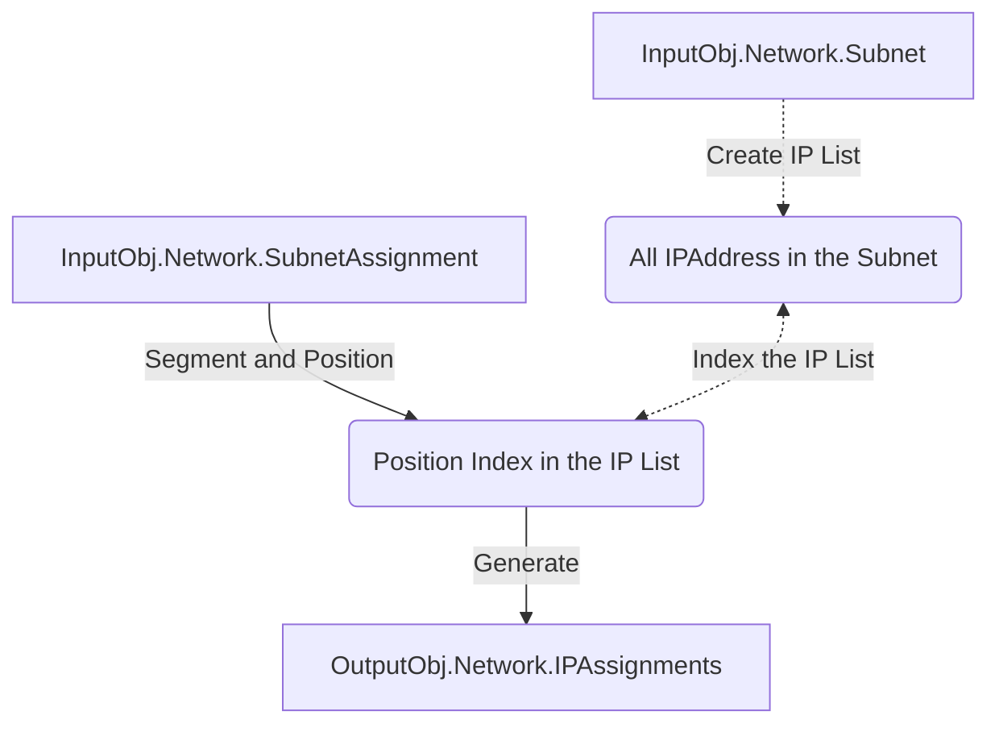

## IP Caculator Logic of Network Assignment

### Logic Diagram



#### Segment and Position Logic

The IP Assignment will be sorted by assigned netmask in **descend order** and then assigned by assgined position.
Example:

- Given Input:

```json
{
  "VlanID": null,
  "Type": "IP",
  "Name": "SwitchMgmt",
  "Subnet": "192.168.1.0/28",
  "Shutdown": false,
  "SubnetAssignment": [
    {
      "Name": "P2P_TOR1_To_Border1",
      "Netmask": 31,
      "IPSize": 2,
      "IPAssignment": [
        {
          "Name": "TOR1_Loopback0",
          "Netmask": 32,
          "IPSize": 1,
          "IPAssignment": [
            {
              "Name": "TOR1_Loopback0",
              "Position": 0
            }
          ]
        },
        {
          "Name": "P2P_TOR1_To_Border1",
          "Netmask": 31,
          "IPSize": 2,
          "IPAssignment": [
            {
              "Name": "TOR1",
              "Position": 0
            },
            {
              "Name": "Border1",
              "Position": 1
            }
          ]
        }
      ]
    }
  ]
}
```

- Get Output:

```json
{
  "VlanID": 0,
  "Type": "IP",
  "Name": "SwitchMgmt",
  "Subnet": "192.168.1.0/28",
  "Shutdown": false,
  "IPAssignment": [
    {
      "Name": "P2P_TOR1_To_Border1/TOR1",
      "IPAddress": "192.168.1.0/31"
    },
    {
      "Name": "P2P_TOR1_To_Border1/Border1",
      "IPAddress": "192.168.1.1/31"
    },
    {
      "Name": "TOR1_Loopback0/TOR1_Loopback0",
      "IPAddress": "192.168.1.2/32"
    }
  ]
}
```
