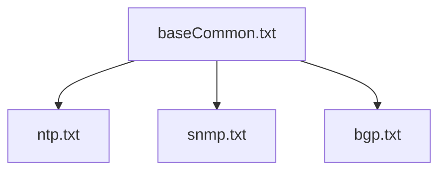
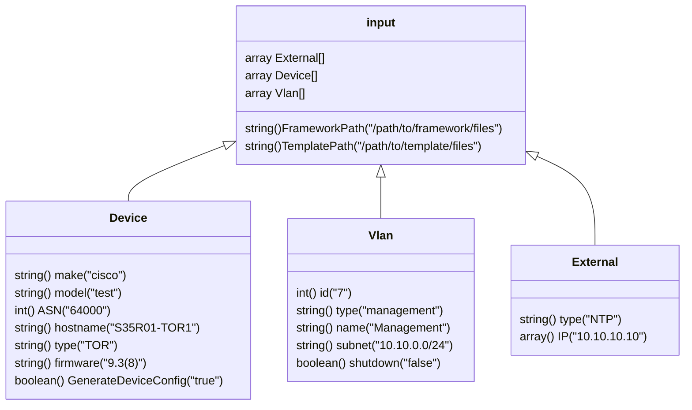

[TOC]

# Application

To Do List:

### Framework

 ```mermaid
 graph TD;
 Router-->Prefix
 Router-->RouteMap
 Inband-->InterfaceAttributes
 InterfaceAttributes-->VLAN
 InterfaceAttributes-->PortChannel
 InterfaceAttributes-->IP
 Device
 OutOfBand
 QOS
 SpanningTree
 Logging
 ```


- [x] Separate [framework.json](framework.json) based on the diagram.
- [x] Define reference input JSON template.
- [x] Define Vendor/Firmware/Template hierarchy.

## Template Paths

The Template files will match the device make, model and firmware.


#### Directory Structure
```text
template/cisco/93180yc-fx/9.3/
   - baseCommon.txt
   - ntp.txt
   - snmp.txt
   - bgp.txt
   ...
```

The baseCommon file will determine what files are called and in what order.  Base common file contains boilerplate default device settings.  Inside the baseCommon it will reference more specific template files like ntp, nsmp, bgp, etc.   Once all the templates are processed, the index will be used to combine the data into a single file.  The exported file name will be based on the Hostname in the Input details.

### baseCommon.txt

```go
hostname {{ .Device.Hostname }}
{{ template "header" .Device }}
{{ tempalte "ntp" .External }}

```

## Input Details

The initial set of inputs will remain as simple as possible.  This will consist of a set of devices in the rack.

### Assumptions

1. The initial set of rack configurations will be fixed.  
2. All VLANs will be tagged to all defined host ports.  
3. The port definition will be based on the framework files.
4. There will be 16 nodes per rack.
5. There will be multiple clusters operating within a single rack.
   1. Clusters will share the same VLAN ID.
   2. Clusters will share the same subnets and only utilizing a range.

6. The network port connectivity will be based on a HUB layout.
7. The routing protocol will use BGP.

### Questions

1. ~~16 total nodes in a rack.  Should we outline this in the input?~~, This is supported in a framework file.
2. ~~Port utilization is not outlined. Ports 1-x for Compute, x-x for Storage.~~ This is supported in a framework file
3. ~~If BGP is being used, the AS numbers should be included in the input file.~~ The Input file has been updated with a AS number
4. ~~Using the existing input file below, how do we know what the Software AS number is and the uplink BGP AS numbers is?  I think more devices need to be listed....~~, The input file has been updated with a MUX device. this will be used to service all software BGP configurations.
5. ~~In NTP, we need to know the IP address of the NTP server.  This needs to become an input.,~~ Input added to support values like NTP
6. ~~logging, if a syslog server is used, this needs to become a standard input value.~~ Input data was updated.
7. How are IP assignments determined if we don't have a IP spreadsheet to start from?  Do we need a IP framework to determine individual IP assignments, this way any subnetting that is preformed is standardized. 

## JSON



```JSON
{
    "Framework": "path/to/framework/root",
    "Template": "path/to/template/root",
    "External": [
        {
            "Type": "NTP",
            "IP": [
                "10.10.10.10"
            ]
        }
    ],
    "Device": [
        {
            "Make": "Cisco",
            "Type": "TOR1",
            "ASN": 65000,
            "Hostname": "S31R28-TOR1",
            "Model": "93180YC-FX",
            "Firmware": 9.3,
            "GenerateDeviceConfig": true
        },
        {
            "Make": "Cisco",
            "Type": "TOR2",
            "ASN": 65000,
            "Hostname": "S31R28-TOR1",
            "Model": "93180YC-FX",
            "Firmware": 9.3,
            "GenerateDeviceConfig": true
        },
        {
            "Make": "Dell",
            "Type": "BMC",
            "ASN": "",
            "Hostname": "S31R28-BMC",
            "Model": "S3048",
            "Firmware": 9.2,
            "GenerateDeviceConfig": true
        },
        {
            "Make": "",
            "Type": "Router",
            "ASN": "63000",
            "Hostname": "S31R28-BMC",
            "Model": "router",
            "Firmware": null,
            "GenerateDeviceConfig": false
        },
        {
            "Make": "",
            "Type": "Uplink",
            "ASN": "62000",
            "Hostname": "S31R28-Uplink1",
            "Model": "",
            "Firmware": null,
            "GenerateDeviceConfig": false
        }
    ],
    "SwitchVlan": [
        {
            "ID": 2,
            "Type": "Unused",
            "Name": "UnusedPort",
            "Subnet": "",
            "Shutdown": true
        },
        {
            "ID": 7,
            "Type": "Compute",
            "Name": "HNVPANetwork",
            "Subnet": "10.10.100.0/24",
            "Shutdown": false
        },
        {
            "ID": 8,
            "Type": "Compute",
            "Name": "Management",
            "Subnet": "10.10.101.0/24",
            "Shutdown": false
        },
        {
            "ID": 25,
            "Type": "OOB",
            "Name": "BMC",
            "Subnet": "192.168.0.0/26",
            "Shutdown": false
        },
        {
            "ID": 15,
            "Type": "Compute",
            "Name": "Tenant1",
            "Subnet": "10.100.0.0/24",
            "Shutdown": false
        },
        {
            "ID": 711,
            "Type": "Storage",
            "Name": "Storage1",
            "Subnet": "",
            "Shutdown": false
        },
        {
            "ID": 712,
            "Type": "Storage",
            "Name": "Storage2",
            "Subnet": "",
            "Shutdown": false
        }
    ]
}
```
