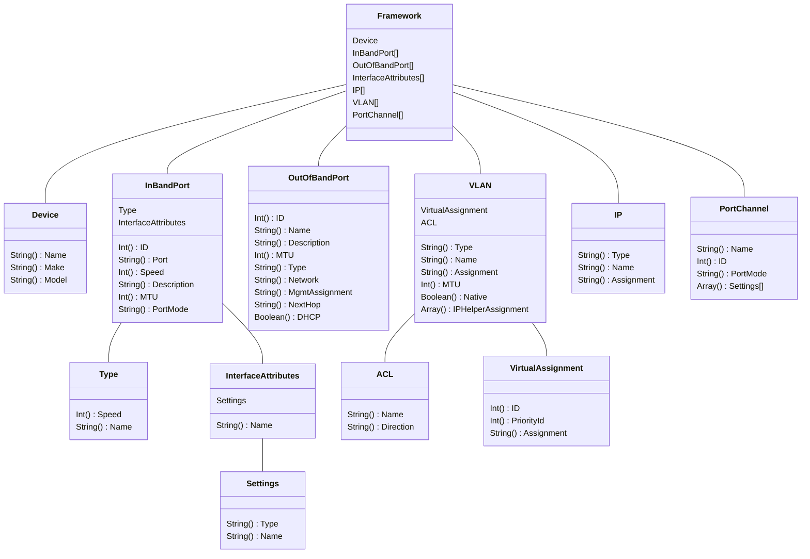
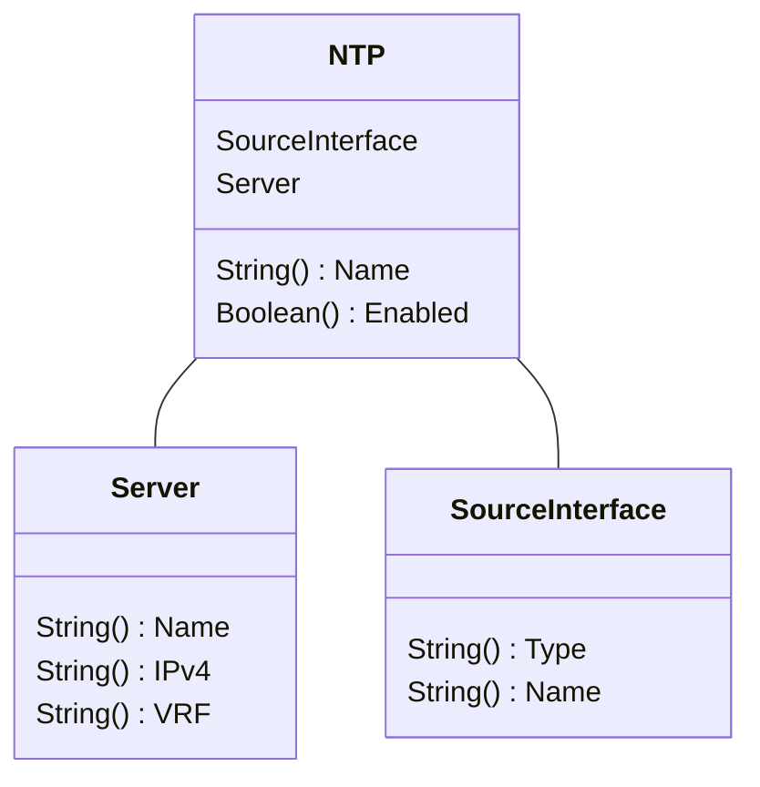
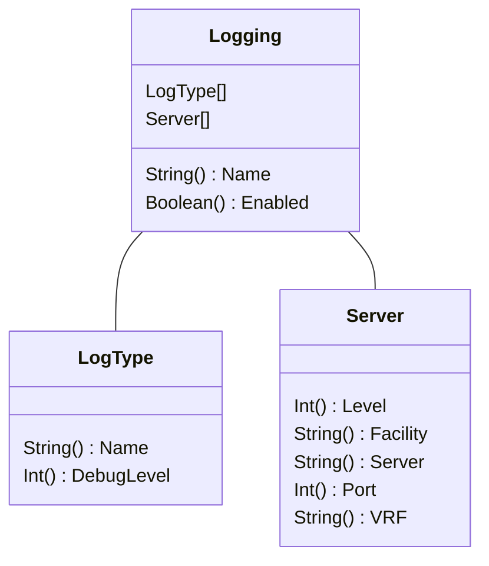
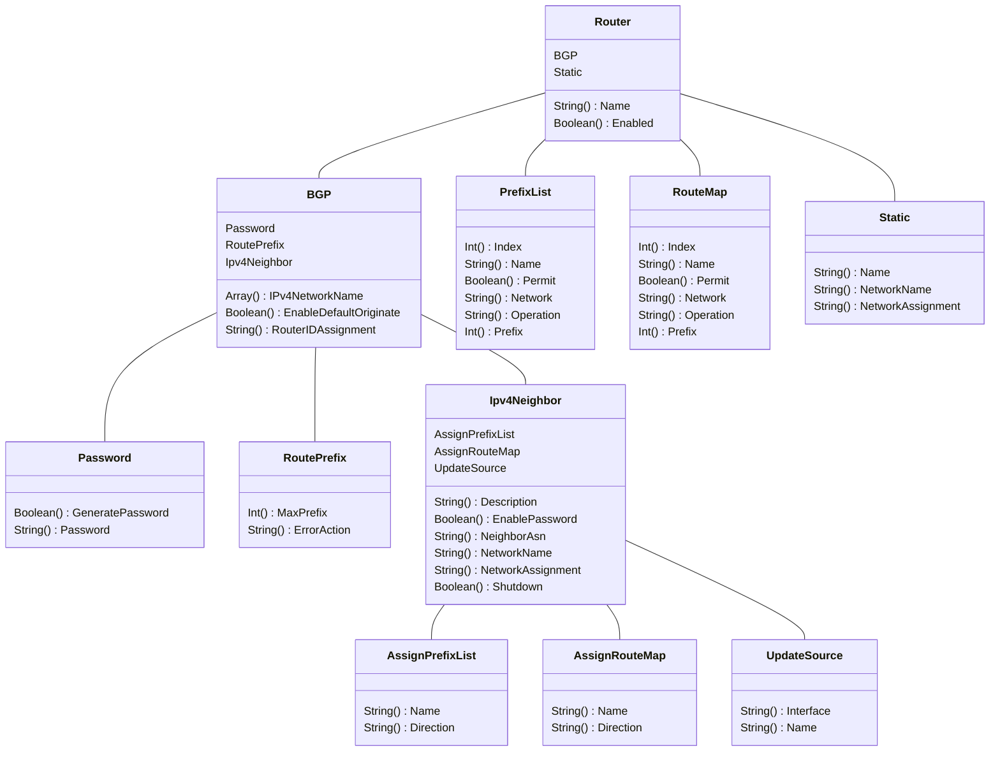
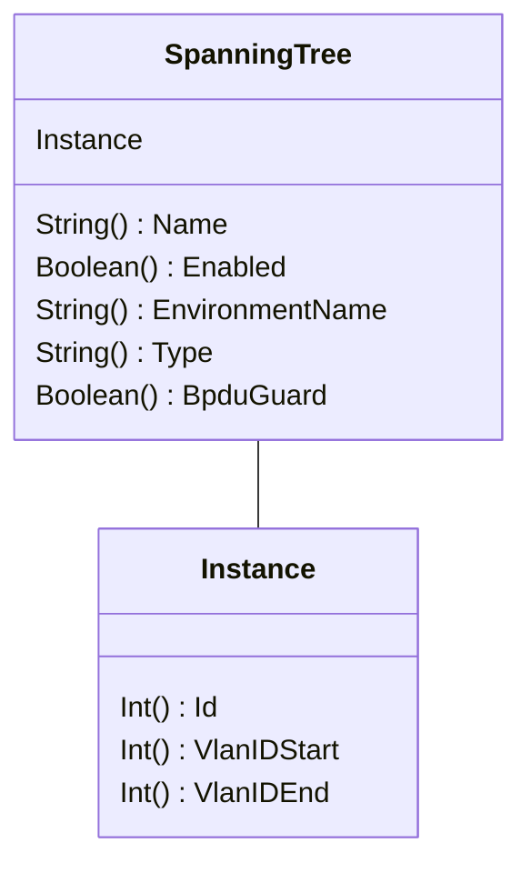
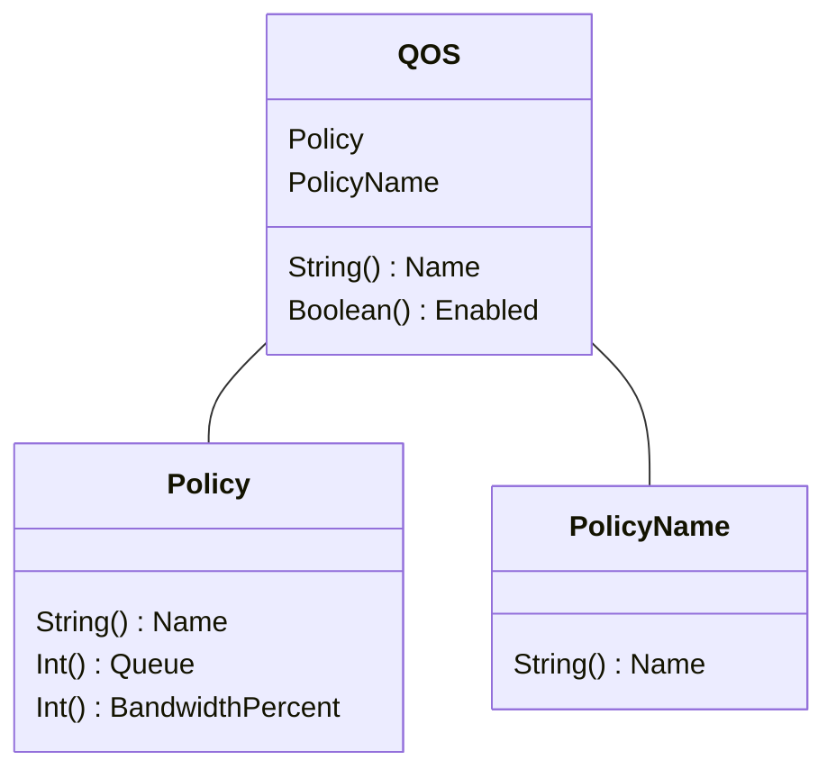

# Frameworks

## Base Framework JSON

```mermaid

classDiagram

    Framework--Device
    Framework--InBandPort
    InBandPort--Type
    Framework--OutOfBandPort
    InBandPort--InterfaceAttributes
    InterfaceAttributes--Settings
    Framework--VLAN
    Framework--IP
    Framework--PortChannel
    VLAN--ACL
    VLAN--VirtualAssignment

class Framework {
        Device
        InBandPort[]
        OutOfBandPort[]
        InterfaceAttributes[]
        IP[]
        VLAN[]
        PortChannel[]
}

class Device{
        String() Name
        String() Make
        String() Model
}

class InBandPort {
        Int() ID
        String() Port
        Int() Speed
        Type
        String() Description
        Int() MTU
        String() PortMode
        InterfaceAttributes
}
class Type {
    Int() Speed
    String() Name
}
class OutOfBandPort {
    Int() ID
    String() Name
    String() Description
    Int() MTU
    String() Type
    String() Network
    String() MgmtAssignment
    String() NextHop
    Boolean() DHCP
}

class InterfaceAttributes {
    String() Name
    Settings
}
class Settings{
    String() Type
    String() Name
}
class VLAN{
    String() Type
    String() Name
    String() Assignment
    Int() MTU
    Boolean() Native
    VirtualAssignment
    Array() IPHelperAssignment
    ACL
}
class VirtualAssignment{
    Int() ID
    Int() PriorityId
    String() Assignment
}
class ACL {
    String() Name
    String() Direction
}
class IP {
    String() Type
    String() Name
    String() Assignment
}
class PortChannel {
    String() Name
    Int() ID
    String() PortMode
    Array() Settings[]
}
```

## NTP JSON

```mermaid

classDiagram
NTP--Server
NTP--SourceInterface

class NTP {
    String() Name
    Boolean() Enabled
    SourceInterface
    Server
}

class Server {
    String() Name
    String() IPv4
    String() VRF
}

class SourceInterface{
    String() Type
    String() Name
}
```

## Logging JSON

```mermaid
classDiagram
Logging--LogType
Logging--Server
class Logging{
    String() Name
    Boolean() Enabled
    LogType[]
    Server[]
}
class LogType{
    String() Name
    Int() DebugLevel
}
class Server{
    Int() Level
    String() Facility
    String() Server
    Int() Port
    String() VRF
}
```

## Router JSON

```mermaid
classDiagram
Router--BGP
Router--PrefixList
Router--RouteMap
BGP--Password
BGP--RoutePrefix
BGP--Ipv4Neighbor
Ipv4Neighbor--AssignPrefixList
Ipv4Neighbor--AssignRouteMap
Ipv4Neighbor--UpdateSource
Router--Static
class Router{
    String() Name
    Boolean() Enabled
    BGP
    Static
}
class BGP {
    Array() IPv4NetworkName
    Password
    Boolean() EnableDefaultOriginate
    RoutePrefix
    String() RouterIDAssignment
    Ipv4Neighbor
}
class RoutePrefix{
    Int() MaxPrefix
    String() ErrorAction
}
class Ipv4Neighbor{
    String() Description
    Boolean() EnablePassword
    String() NeighborAsn
    String() NetworkName
    String() NetworkAssignment
    AssignPrefixList
    AssignRouteMap
    UpdateSource
    Boolean() Shutdown
}
class AssignPrefixList{
    String() Name
    String() Direction
}
class AssignRouteMap {
    String() Name
    String() Direction
}
class UpdateSource {
    String() Interface
    String() Name
}
class Static{
    String() Name
    String() NetworkName
    String() NetworkAssignment
}
class Password {
    Boolean() GeneratePassword
    String() Password
}
class PrefixList {
    Int() Index
    String() Name
    Boolean() Permit
    String() Network
    String() Operation
    Int() Prefix
}
class RouteMap {
    Int() Index
    String() Name
    Boolean() Permit
    String() Network
    String() Operation
    Int() Prefix
}

```

## SpanningTree

```mermaid
classDiagram
SpanningTree--Instance
class SpanningTree{
    String() Name
    Boolean() Enabled
    String() EnvironmentName
    String() Type
    Boolean() BpduGuard
    Instance
}
class Instance{
    Int() Id
    Int() VlanIDStart
    Int() VlanIDEnd
}
```

## QOS

```mermaid
classDiagram
QOS--Policy
QOS--PolicyName
class QOS {
    String() Name
    Boolean() Enabled
    Policy
    PolicyName
}
class Policy{
    String() Name
    Int() Queue
    Int() BandwidthPercent
}
class PolicyName{
    String() Name
}
```