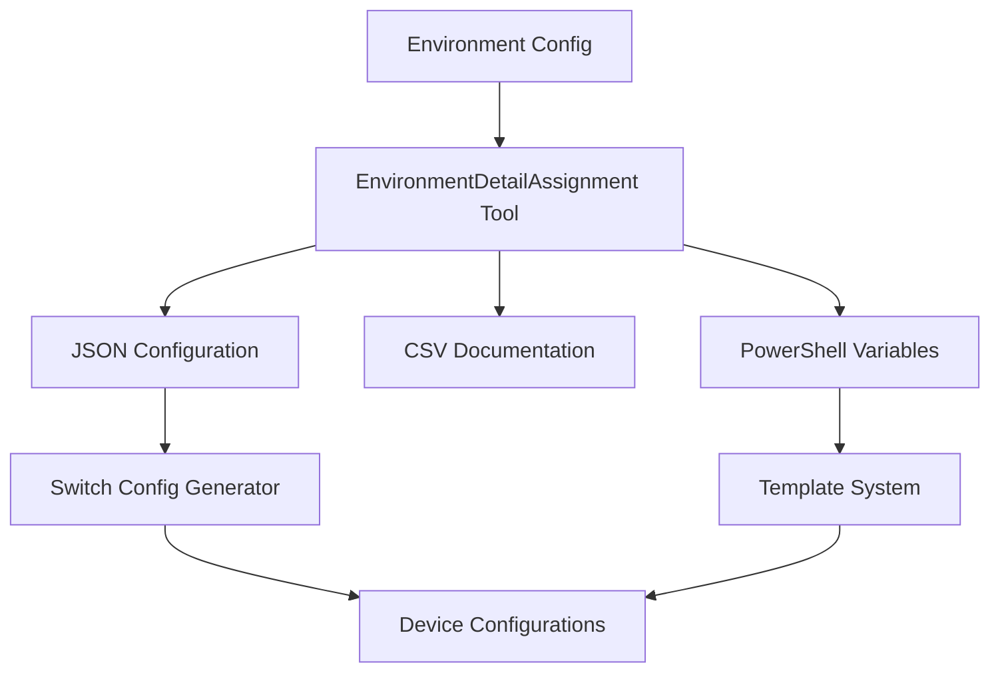

# 🌍 EnvironmentDetailAssignment Tool

[](https://docs.microsoft.com/en-us/powershell/)
[](../../LICENSE)
[](README.md)
[](README.md#json-configuration-support)
[](README.md#testing--validation)
[](README.md#output-formats)

> 🌟 **Key Features**: Environment-specific configuration assignment • Network parameter management • Multi-environment support • Template variable generation • Comprehensive validation

## 📋 Table of Contents

- [🌍 EnvironmentDetailAssignment Tool](#-environmentdetailassignment-tool)
  - [📋 Table of Contents](#-table-of-contents)
  - [📖 Overview](#-overview)
  - [⚡ Quick Start](#-quick-start)
  - [🎯 Purpose](#-purpose)
  - [✨ Features](#-features)
    - [Core Functionality](#core-functionality)
    - [Advanced Features](#advanced-features)
    - [🌐 Environment Support](#-environment-support)
    - [📄 Output Formats](#-output-formats)
      - [1. JSON Configuration](#1-json-configuration)
      - [2. CSV Format - Environment Matrix](#2-csv-format---environment-matrix)
      - [3. PowerShell Variables](#3-powershell-variables)
  - [👥 Target Audience](#-target-audience)
  - [📝 Input Requirements](#-input-requirements)
    - [Environment Configuration JSON](#environment-configuration-json)
    - [Environment Types](#environment-types)
    - [Parameter Categories](#parameter-categories)
  - [⚙️ Installation & Dependencies](#️-installation--dependencies)
    - [Prerequisites](#prerequisites)
    - [Dependencies](#dependencies)
    - [Key Features & Recent Improvements](#key-features--recent-improvements)
      - [Multi-Environment Support](#multi-environment-support)
      - [Template Variable Generation](#template-variable-generation)
      - [Intelligent Parameter Assignment](#intelligent-parameter-assignment)
      - [Professional Output Formats](#professional-output-formats)
      - [Comprehensive Validation](#comprehensive-validation)
  - [🚀 Usage](#-usage)
    - [Basic Usage](#basic-usage)
    - [🌐 Multi-Environment Examples](#-multi-environment-examples)
    - [Automatic File Naming](#automatic-file-naming)
  - [🔄 Integration with AzureStack Network Switch Config Generator](#-integration-with-azurestack-network-switch-config-generator)
  - [💼 Use Cases](#-use-cases)
    - [1. Environment-Specific Network Configuration](#1-environment-specific-network-configuration)
    - [2. Template Variable Generation](#2-template-variable-generation)
    - [3. Multi-Datacenter Deployment](#3-multi-datacenter-deployment)
    - [4. Configuration Validation](#4-configuration-validation)
    - [5. Environment Documentation](#5-environment-documentation)
  - [📊 Output Examples](#-output-examples)
    - [Sample Output Files](#sample-output-files)
    - [Environment Summary Table](#environment-summary-table)
    - [JSON Configuration Output](#json-configuration-output)
    - [PowerShell Variables Output](#powershell-variables-output)
  - [🛠️ Error Handling & Logging](#️-error-handling--logging)
    - [Error Detection](#error-detection)
    - [Environment Validation](#environment-validation)
    - [Logging Features](#logging-features)
    - [Robust Operation](#robust-operation)
  - [🧪 Testing & Validation](#-testing--validation)
    - [Automated Testing](#automated-testing)
    - [Environment Testing](#environment-testing)
    - [Validation Features](#validation-features)
    - [Sample Configurations](#sample-configurations)
  - [🤝 Contributing](#-contributing)
    - [Development Guidelines](#development-guidelines)
  - [📞 Support](#-support)
    - [🐛 Found a Bug?](#-found-a-bug)
    - [💡 Feature Requests](#-feature-requests)
    - [🆘 Need Help?](#-need-help)
  - [🔗 Related Projects](#-related-projects)
    - [🏗️ Architecture Overview](#️-architecture-overview)
  - [📚 Version History](#-version-history)
    - [**v1.0** (Current)](#v10-current)

## 📖 Overview

The EnvironmentDetailAssignment tool is a comprehensive environment configuration management utility designed to assign and manage environment-specific parameters for network device configurations. It enables seamless deployment across multiple environments (Development, Staging, Production) by providing environment-aware parameter assignment and template variable generation.

## ⚡ Quick Start

```powershell
# 1️⃣ Generate environment configuration for all environments
.\EnvironmentDetailAssignment.ps1 -ConfigPath "environment-config.json" -OutputFormat JSON

# 2️⃣ Generate configuration for specific environment
.\EnvironmentDetailAssignment.ps1 -ConfigPath "environment-config.json" -Environment "Production" -OutputFormat JSON

# 3️⃣ Generate PowerShell variables for template usage  
.\EnvironmentDetailAssignment.ps1 -ConfigPath "environment-config.json" -OutputFormat PowerShell
```

> 📋 **Prerequisites**: PowerShell 5.1+ and a valid JSON configuration file describing your environment parameters.

## 🎯 Purpose

This tool solves critical environment configuration challenges in network deployment by:

- **Environment-Specific Configuration**: Managing different parameter sets for Development, Staging, and Production environments
- **Parameter Assignment**: Automatically assigning IP ranges, VLANs, hostnames, and other environment-specific values
- **Template Integration**: Generating variables for use with Jinja2 templates and configuration generators
- **Multi-Environment Support**: Supporting complex multi-datacenter and multi-environment deployments
- **Configuration Validation**: Ensuring parameter consistency and conflict detection across environments
- **Integration Ready**: Generating outputs that seamlessly integrate with switch configuration generators

## ✨ Features

### Core Functionality

- **Environment-Aware Parameter Management**: Assigns different values based on target environment (Dev/Staging/Prod)
- **Network Parameter Assignment**: Manages IP ranges, subnets, VLANs, and network-specific configurations
- **Hostname and Device Management**: Generates environment-specific device names and identifiers
- **Template Variable Generation**: Creates variables for Jinja2 templates and configuration systems
- **Multi-Format Output**: Supports JSON, CSV, and PowerShell variable formats
- **Configuration Validation**: Validates parameter consistency and detects conflicts

### Advanced Features

- **Hierarchical Configuration**: Supports global defaults with environment-specific overrides
- **Parameter Templating**: Enables dynamic parameter generation using template patterns
- **Dependency Management**: Handles parameter dependencies and cross-references
- **Environment Inheritance**: Allows environments to inherit and override base configurations
- **Bulk Assignment**: Processes multiple devices and environments simultaneously
- **Professional Documentation**: Generates comprehensive environment documentation

### 🌐 Environment Support

The tool provides comprehensive support for multiple environment types commonly used in enterprise deployments:

#### Supported Environment Types

- **Development**: Development and testing environments with isolated resources
- **Staging**: Pre-production staging environments for validation
- **Production**: Production environments with high-availability configurations
- **DR (Disaster Recovery)**: Disaster recovery sites with alternate configurations
- **Management**: Management and administrative environments

#### Environment-Specific Parameters

```json
{
  "environments": {
    "Development": {
      "networkPrefix": "192.168.10.0/24",
      "vlanBase": 100,
      "deviceSuffix": "dev",
      "managementVlan": 101,
      "ntpServers": ["192.168.10.1", "192.168.10.2"]
    },
    "Production": {
      "networkPrefix": "10.0.0.0/16", 
      "vlanBase": 1000,
      "deviceSuffix": "prod",
      "managementVlan": 1001,
      "ntpServers": ["10.0.1.1", "10.0.1.2"]
    }
  }
}
```

### 📄 Output Formats

#### 1. JSON Configuration

Structured environment configuration for integration with other tools:

```json
{
  "environments": {
    "Production": {
      "devices": {
        "TOR-1": {
          "hostname": "TOR-1-prod",
          "managementIP": "10.0.1.10",
          "managementVlan": 1001,
          "parameters": {
            "ntpServers": ["10.0.1.1", "10.0.1.2"],
            "dnsServers": ["10.0.1.3", "10.0.1.4"]
          }
        }
      },
      "networkConfig": {
        "baseNetwork": "10.0.0.0/16",
        "managementSubnet": "10.0.1.0/24",
        "vlanRange": "1000-1099"
      }
    }
  }
}
```

#### 2. CSV Format - Environment Matrix

Tabular format showing parameter variations across environments:

```csv
"Parameter","Development","Staging","Production","Notes"
"NetworkPrefix","192.168.10.0/24","192.168.20.0/24","10.0.0.0/16","Base network range"
"VlanBase","100","200","1000","Starting VLAN ID"
"DeviceSuffix","dev","stage","prod","Hostname suffix"
"ManagementVlan","101","201","1001","Management VLAN ID"
```

#### 3. PowerShell Variables

PowerShell variable definitions for template and script usage:

```powershell
# Environment: Production
$EnvironmentName = "Production"
$NetworkPrefix = "10.0.0.0/16"
$VlanBase = 1000
$DeviceSuffix = "prod"
$ManagementVlan = 1001
$NtpServers = @("10.0.1.1", "10.0.1.2")
```

## 👥 Target Audience

- **Network Engineers**: Primary users for managing environment-specific network configurations
- **DevOps Engineers**: For automated deployment and configuration management
- **System Administrators**: For understanding and maintaining multi-environment infrastructure
- **Template Developers**: For creating environment-aware configuration templates

## 📝 Input Requirements

### Environment Configuration JSON

The tool requires a JSON file describing environment parameters and assignments:

```json
{
  "globalDefaults": {
    "ntpServers": ["time.nist.gov", "pool.ntp.org"],
    "dnsServers": ["8.8.8.8", "8.8.4.4"],
    "deviceTypes": ["TOR", "SPINE", "LEAF"]
  },
  "environments": {
    "Development": {
      "networkPrefix": "192.168.10.0/24",
      "vlanBase": 100,
      "deviceSuffix": "dev",
      "managementVlan": 101,
      "ntpServers": ["192.168.10.1"],
      "devices": {
        "TOR-1": {
          "managementIP": "192.168.10.10",
          "location": "Rack-01"
        }
      }
    },
    "Production": {
      "networkPrefix": "10.0.0.0/16",
      "vlanBase": 1000,
      "deviceSuffix": "prod", 
      "managementVlan": 1001,
      "ntpServers": ["10.0.1.1", "10.0.1.2"],
      "devices": {
        "TOR-1": {
          "managementIP": "10.0.1.10",
          "location": "DataCenter-01"
        }
      }
    }
  },
  "parameterTemplates": {
    "hostnamePattern": "{deviceName}-{environment}",
    "vlanAssignment": "{vlanBase} + {deviceIndex}"
  }
}
```

### Environment Types

The tool supports standard environment types:

- **Development**: Development and testing environments
- **Staging**: Pre-production validation environments  
- **Production**: Live production environments
- **DR**: Disaster recovery environments
- **Management**: Administrative environments

### Parameter Categories

- **Network Parameters**: IP ranges, subnets, VLAN assignments
- **Device Parameters**: Hostnames, management IPs, locations
- **Service Parameters**: NTP servers, DNS servers, logging destinations
- **Security Parameters**: Authentication settings, access controls
- **Application Parameters**: Custom application-specific settings

## ⚙️ Installation & Dependencies

### Prerequisites

- PowerShell 5.1 or PowerShell Core 7.0+ (cross-platform compatible)
- JSON configuration file describing your environment parameters
- Write permissions to the output directory

### Dependencies

- No external PowerShell modules required
- Uses built-in PowerShell JSON and CSV cmdlets
- Leverages .NET Framework/Core collections for optimal performance

### Key Features & Recent Improvements

#### Multi-Environment Support

- **Environment Inheritance**: Base configurations with environment-specific overrides
- **Parameter Cascading**: Global defaults inherited by all environments
- **Conflict Detection**: Automatic detection of parameter conflicts between environments
- **Environment Validation**: Comprehensive validation of environment configurations

#### Template Variable Generation

- **Jinja2 Integration**: Generates variables compatible with Jinja2 templates
- **PowerShell Variables**: Creates PowerShell variable definitions for scripting
- **Parameter Substitution**: Supports dynamic parameter generation using templates
- **Variable Scoping**: Proper variable scoping for multi-environment usage

#### Intelligent Parameter Assignment

- **Dynamic Assignment**: Calculates derived parameters based on base values
- **Pattern-Based Generation**: Uses patterns to generate consistent naming and numbering
- **Dependency Resolution**: Resolves parameter dependencies automatically
- **Range Validation**: Validates parameter ranges and constraints

#### Professional Output Formats

Multiple output formats for different use cases:

- **JSON Configuration**: Machine-readable format for integration
- **CSV Documentation**: Tabular format for documentation and analysis
- **PowerShell Variables**: Script-ready variable definitions
- **Template Files**: Ready-to-use template variable files

#### Comprehensive Validation

- **Schema Validation**: Validates input configuration against expected schema
- **Parameter Validation**: Checks parameter values against constraints
- **Environment Consistency**: Ensures consistency across environments
- **Conflict Detection**: Identifies and reports parameter conflicts

## 🚀 Usage

### Basic Usage

```powershell
# Generate configuration for all environments
.\EnvironmentDetailAssignment.ps1 -ConfigPath "env-config.json" -OutputFormat JSON

# Generate configuration for specific environment
.\EnvironmentDetailAssignment.ps1 -ConfigPath "env-config.json" -Environment "Production" -OutputFormat JSON

# Generate CSV matrix showing all environments
.\EnvironmentDetailAssignment.ps1 -ConfigPath "env-config.json" -OutputFormat CSV

# Generate PowerShell variables for template usage
.\EnvironmentDetailAssignment.ps1 -ConfigPath "env-config.json" -OutputFormat PowerShell

# Validate configuration without generating output
.\EnvironmentDetailAssignment.ps1 -ConfigPath "env-config.json" -Validate
```

### 🌐 Multi-Environment Examples

```powershell
# Generate configurations for multiple environments
.\EnvironmentDetailAssignment.ps1 -ConfigPath "multi-env.json" -Environments @("Development","Staging","Production") -OutputFormat JSON

# Generate template variables for specific environment
.\EnvironmentDetailAssignment.ps1 -ConfigPath "datacenter.json" -Environment "Production" -OutputFormat PowerShell -TemplateCompatible

# Export environment matrix for documentation
.\EnvironmentDetailAssignment.ps1 -ConfigPath "environments.json" -OutputFormat CSV -IncludeDocumentation
```

<details>
<summary><strong>📝 Command Line Parameters</strong></summary>

| Parameter            | Type         | Required | Description                                          |
| -------------------- | ------------ | -------- | ---------------------------------------------------- |
| `-ConfigPath`        | String       | ✅       | Path to the environment configuration JSON file      |
| `-OutputFormat`      | String       | ✅       | Output format: `JSON`, `CSV`, or `PowerShell`        |
| `-Environment`       | String       | ❌       | Target specific environment (default: all)           |
| `-Environments`      | String Array | ❌       | Target multiple specific environments                 |
| `-OutputFile`        | String       | ❌       | Custom output file path                              |
| `-TemplateCompatible`| Switch       | ❌       | Generate template-compatible variable format         |
| `-IncludeDocumentation`| Switch     | ❌       | Include documentation and metadata in output         |
| `-Validate`          | Switch       | ❌       | Validate configuration without generating output     |
| `-Detailed`          | Switch       | ❌       | Display detailed progress information                |

</details>

### Automatic File Naming

The tool generates intelligent output filenames:

**Examples**:

- JSON: `env-config-Production-environment-assignment.json`
- CSV: `env-config-all-environments-matrix.csv`
- PowerShell: `env-config-Production-variables.ps1`

## 🔄 Integration with AzureStack Network Switch Config Generator

The EnvironmentDetailAssignment tool integrates seamlessly with the main project:

1. **Configuration Generation**: Provides environment-specific parameters for switch configuration generation
2. **Template Integration**: Generates variables for use with Jinja2 templates
3. **Multi-Environment Deployment**: Enables deployment across multiple environments with different parameters
4. **Parameter Validation**: Ensures environment parameters are valid before configuration generation
5. **Documentation**: Provides environment-specific documentation alongside generated configurations

## 💼 Use Cases

### 1. Environment-Specific Network Configuration

Assign different network parameters for each environment:

```powershell
.\EnvironmentDetailAssignment.ps1 -ConfigPath "network-environments.json" -OutputFormat JSON
# Generates environment-specific IP ranges, VLANs, and network configurations
```

### 2. Template Variable Generation

Generate variables for Jinja2 templates:

```powershell
.\EnvironmentDetailAssignment.ps1 -ConfigPath "template-vars.json" -Environment "Production" -OutputFormat PowerShell -TemplateCompatible
# Creates PowerShell variables compatible with template systems
```

### 3. Multi-Datacenter Deployment

Manage configurations across multiple datacenters:

```powershell
.\EnvironmentDetailAssignment.ps1 -ConfigPath "multi-datacenter.json" -Environments @("DC1-Prod","DC2-Prod") -OutputFormat JSON
# Generates datacenter-specific configurations
```

### 4. Configuration Validation

Validate environment configurations before deployment:

```powershell
.\EnvironmentDetailAssignment.ps1 -ConfigPath "production.json" -Validate
# Validates configuration without generating output
```

### 5. Environment Documentation

Generate documentation showing parameter differences:

```powershell
.\EnvironmentDetailAssignment.ps1 -ConfigPath "all-environments.json" -OutputFormat CSV -IncludeDocumentation
# Creates comprehensive environment documentation matrix
```

## 📊 Output Examples

### Sample Output Files

**Generated Filenames** (with automatic naming):

**JSON Output:**
- `env-config-Production-environment-assignment.json`

**CSV Output:**
- `env-config-all-environments-matrix.csv`

**PowerShell Output:**
- `env-config-Production-variables.ps1`

### Environment Summary Table

| Environment | Network Prefix   | VLAN Base | Device Suffix | Management VLAN |
| ----------- | ---------------- | --------- | ------------- | --------------- |
| Development | 192.168.10.0/24  | 100       | dev           | 101             |
| Staging     | 192.168.20.0/24  | 200       | stage         | 201             |
| Production  | 10.0.0.0/16      | 1000      | prod          | 1001            |

### JSON Configuration Output

```json
{
  "metadata": {
    "generatedBy": "EnvironmentDetailAssignment",
    "generatedAt": "2024-01-15T10:30:00Z",
    "configFile": "env-config.json",
    "environments": ["Development", "Staging", "Production"]
  },
  "environments": {
    "Production": {
      "globalParameters": {
        "networkPrefix": "10.0.0.0/16",
        "vlanBase": 1000,
        "deviceSuffix": "prod"
      },
      "devices": {
        "TOR-1": {
          "hostname": "TOR-1-prod",
          "managementIP": "10.0.1.10",
          "managementVlan": 1001
        }
      }
    }
  }
}
```

### PowerShell Variables Output

```powershell
# Generated by EnvironmentDetailAssignment Tool
# Environment: Production
# Generated: 2024-01-15 10:30:00

# Global Environment Parameters
$EnvironmentName = "Production"
$NetworkPrefix = "10.0.0.0/16"
$VlanBase = 1000
$DeviceSuffix = "prod"
$ManagementVlan = 1001

# Device-Specific Parameters
$TOR1_Hostname = "TOR-1-prod"
$TOR1_ManagementIP = "10.0.1.10"
$TOR1_Location = "DataCenter-01"

# Service Parameters
$NtpServers = @("10.0.1.1", "10.0.1.2")
$DnsServers = @("10.0.1.3", "10.0.1.4")
```

## 🛠️ Error Handling & Logging

The tool includes comprehensive error handling and logging:

### Error Detection

- Invalid JSON input files with detailed syntax error reporting
- Missing or malformed environment configurations
- Parameter conflicts between environments
- Invalid parameter values and constraint violations
- Missing required parameters with helpful error messages
- File permission and path validation issues

### Environment Validation

- **Schema Validation**: Ensures input configuration follows expected schema
- **Parameter Validation**: Validates parameter values against constraints
- **Environment Consistency**: Checks consistency across environments
- **Dependency Validation**: Ensures parameter dependencies are satisfied
- **Conflict Detection**: Identifies conflicting parameter assignments

### Logging Features

- Configurable logging levels (Info, Warning, Error)
- Detailed processing information with timestamps
- File operation status and output location details
- Processing statistics and validation results
- Environment processing logs with detailed progress
- Comprehensive error messages with resolution guidance

### Robust Operation

- Graceful handling of missing optional parameters
- Safe object property access with PowerShell best practices
- Automatic creation of output directories
- Incremental file naming to prevent overwrites
- Input validation with clear error messages
- Default value assignment for optional parameters

## 🧪 Testing & Validation

### Automated Testing

The tool includes comprehensive automated testing:

```powershell
# Run the included test suite
.\Test-EnvironmentDetailAssignment.ps1

# Manual testing with sample configuration
.\EnvironmentDetailAssignment.ps1 -ConfigPath "sample-environment-config.json" -OutputFormat JSON -Validate

# Test multi-environment functionality
.\EnvironmentDetailAssignment.ps1 -ConfigPath "multi-env-test.json" -OutputFormat CSV
```

### Environment Testing

Comprehensive test coverage for environment functionality:

- **Single Environment Testing**: Validates single environment processing
- **Multi-Environment Testing**: Validates multiple environment processing
- **Parameter Inheritance Testing**: Validates parameter inheritance and overrides
- **Template Generation Testing**: Validates template variable generation
- **Output Format Testing**: Ensures all output formats work correctly
- **Validation Testing**: Tests configuration validation features

### Validation Features

- JSON schema validation for input configurations
- Parameter constraint validation
- Environment consistency checking
- Template compatibility validation
- Output file integrity verification
- Processing statistics validation

### Sample Configurations

The tool includes multiple sample configurations:

- `sample-environment-config.json`: Basic environment configuration
- `multi-environment-config.json`: Multi-environment configuration with inheritance
- `template-variables-config.json`: Configuration optimized for template generation
- `datacenter-environments.json`: Multi-datacenter environment configuration

## 🤝 Contributing

This tool is part of the **AzureStack Network Switch Config Generator** project. Please follow the project's contribution guidelines and coding standards.

> 👋 **New Contributors Welcome!** We appreciate contributions of all sizes. Check out our [contributing guide](../../CONTRIBUTING.md) and [code of conduct](../../CODE_OF_CONDUCT.md).

### Development Guidelines

- Maintain PowerShell best practices and StrictMode compatibility
- Include comprehensive comment-based help for all functions
- Add appropriate error handling and logging
- Test environment functionality with provided test configurations
- Update tests for new functionality
- Follow consistent code formatting and naming conventions
- Use proper parameter validation and type checking

## 📞 Support

For issues and questions:

1. 📖 Check the main project's [troubleshooting guide](../../docs/TROUBLESHOOTING.md)
2. 📋 Review input JSON format requirements
3. ✅ Validate environment configuration syntax
4. 🧪 Test with provided sample configurations
5. 📚 Consult the project's [support documentation](../../SUPPORT.md)

### 🐛 Found a Bug?

- 🔍 Search existing [issues](../../issues) first
- 📝 Create a [new issue](../../issues/new) with detailed description
- 📎 Include your configuration file (sanitized)
- 📊 Attach generated output samples

### 💡 Feature Requests

- 💭 Check [discussions](../../discussions) for similar ideas
- 🚀 Submit feature requests via [issues](../../issues/new)
- 🤝 Consider contributing the feature yourself!

### 🆘 Need Help?

- 💬 Join project [discussions](../../discussions)
- 📖 Review the [project wiki](../../wiki)
- 🔗 Check related tools in the [AzureStack ecosystem](#-related-projects)

## 🔗 Related Projects

This tool is part of a comprehensive network configuration ecosystem:

| Project                                        | Description                                       | Status                                                                                                |
| ---------------------------------------------- | ------------------------------------------------- | ----------------------------------------------------------------------------------------------------- |
| **AzureStack Network Switch Config Generator** | Main project for generating switch configurations | [](../../README.md)                        |
| **IP Assignment Tool**                         | Automated IP address management                   | [](../IPAssignment/README.md)                |
| **PortMap Tool**                               | Physical port documentation                       | [](../PortMap/README.md)                     |

### 🏗️ Architecture Overview



## 📚 Version History

### **v1.0** (Current)

**Core Features:**

- Complete environment parameter assignment functionality
- Multiple output formats: JSON, CSV, and PowerShell with consistent formatting
- Professional documentation generation with embedded metadata
- Multi-environment support with inheritance and overrides
- Template variable generation for Jinja2 and PowerShell integration

**Environment Features:**

- **Multi-Environment Support**: Development, Staging, Production, DR environments
- **Parameter Inheritance**: Global defaults with environment-specific overrides
- **Dynamic Assignment**: Calculated parameters based on templates and patterns
- **Dependency Resolution**: Automatic resolution of parameter dependencies
- **Conflict Detection**: Identification and resolution of parameter conflicts

**Advanced Features:**

- Comprehensive parameter validation and constraint checking
- Intelligent automatic file naming with environment and parameter information
- Template-compatible variable generation for integration systems
- Incremental file management to prevent overwrites
- Comprehensive metadata embedding in JSON output formats
- Robust error handling and configurable logging
- Enhanced validation for environment configurations

**PowerShell Best Practices:**

- StrictMode compatibility and safe property access
- Comment-based help with detailed parameter documentation
- Proper error handling with try/catch blocks
- Efficient data structures and processing algorithms
- Cross-platform PowerShell 5.1+ and Core 7.0+ support

**Professional Output:**

- Network engineering standard documentation format
- Environment-specific organization with clear parameter assignment
- Complete processing statistics and generation details
- Integration-ready JSON output with full environment context
- Template-ready variable generation

---

**Note**: This tool is designed to work alongside the main AzureStack Network Switch Config Generator and follows the same architectural patterns and coding standards. The environment assignment functionality enables proper parameter management across multiple deployment environments commonly used in enterprise network deployments.