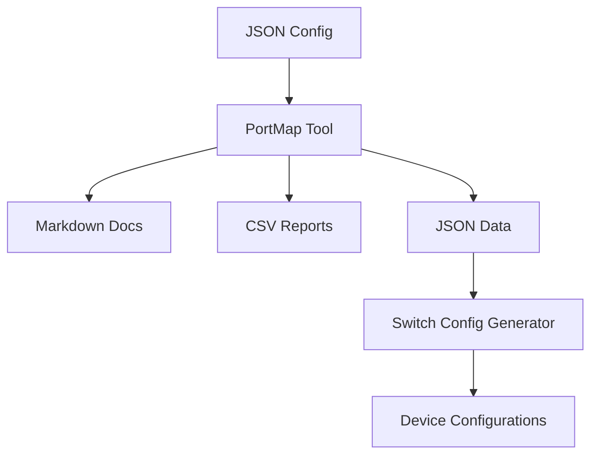

# 🔧 PortMap Tool

[](https://docs.microsoft.com/en-us/powershell/)
[](../../LICENSE)
[](README.MD)
[](README.MD#breakout-cable-support)
[](README.MD#testing--validation)
[](README.MD#output-formats)

> 🌟 **Key Features**: Professional network documentation • QSFP breakout cable support • Multiple output formats • Sequential port ordering • Comprehensive testing suite

## 📋 Table of Contents

- [🔧 PortMap Tool](#-portmap-tool)
  - [📋 Table of Contents](#-table-of-contents)
  - [📖 Overview](#-overview)
  - [⚡ Quick Start](#-quick-start)
  - [🎯 Purpose](#-purpose)
  - [✨ Features](#-features)
    - [Core Functionality](#core-functionality)
    - [Advanced Features](#advanced-features)
    - [🔗 Breakout Cable Support](#-breakout-cable-support)
      - [Supported Breakout Formats](#supported-breakout-formats)
      - [Breakout Cable Examples](#breakout-cable-examples)
      - [Breakout Connection Mapping](#breakout-connection-mapping)
    - [📄 Output Formats](#-output-formats)
      - [1. Markdown Tables](#1-markdown-tables)
      - [2. CSV Format - Individual Files Per Device](#2-csv-format---individual-files-per-device)
      - [3. JSON Format - Consolidated Output](#3-json-format---consolidated-output)
  - [👥 Target Audience](#-target-audience)
  - [📝 Input Requirements](#-input-requirements)
    - [Device Configuration JSON](#device-configuration-json)
    - [Port Range Formats](#port-range-formats)
      - [Standard Port Ranges](#standard-port-ranges)
      - [Breakout Cable Ranges](#breakout-cable-ranges)
      - [Mixed Configurations](#mixed-configurations)
  - [⚙️ Installation \& Dependencies](#️-installation--dependencies)
    - [Prerequisites](#prerequisites)
    - [Dependencies](#dependencies)
    - [Key Features \& Recent Improvements](#key-features--recent-improvements)
      - [Breakout Cable Support (v1.0)](#breakout-cable-support-v10)
      - [Sequential Port Integration](#sequential-port-integration)
      - [Intelligent File Naming](#intelligent-file-naming)
      - [Professional Markdown Output](#professional-markdown-output)
      - [Comprehensive Metadata](#comprehensive-metadata)
    - [CSV Output Behavior](#csv-output-behavior)
      - [Individual Files Per Device](#individual-files-per-device)
      - [File Naming Pattern](#file-naming-pattern)
      - [Examples](#examples)
      - [CSV vs Other Formats](#csv-vs-other-formats)
  - [🚀 Usage](#-usage)
    - [Basic Usage](#basic-usage)
    - [📡 Breakout Cable Usage Examples](#-breakout-cable-usage-examples)
    - [Automatic File Naming](#automatic-file-naming)
  - [🔄 Integration with AzureStack Network Switch Config Generator](#-integration-with-azurestack-network-switch-config-generator)
  - [💼 Use Cases](#-use-cases)
    - [1. Network Design Documentation](#1-network-design-documentation)
    - [2. Breakout Cable Documentation](#2-breakout-cable-documentation)
    - [3. Port Utilization Analysis](#3-port-utilization-analysis)
    - [4. Configuration Generator Input](#4-configuration-generator-input)
    - [5. Device-Specific Spreadsheet Analysis](#5-device-specific-spreadsheet-analysis)
    - [6. Network Auditing](#6-network-auditing)
  - [📊 Output Examples](#-output-examples)
    - [Sample Output Files](#sample-output-files)
    - [Device Summary Table (All Formats)](#device-summary-table-all-formats)
    - [Sequential Port Mapping with Breakout Cables (Markdown with -ShowUnused)](#sequential-port-mapping-with-breakout-cables-markdown-with--showunused)
    - [Embedded Metadata (Markdown and JSON Formats)](#embedded-metadata-markdown-and-json-formats)
  - [🛠️ Error Handling \& Logging](#️-error-handling--logging)
    - [Error Detection](#error-detection)
    - [Breakout Cable Validation](#breakout-cable-validation)
    - [Logging Features](#logging-features)
    - [Robust Operation](#robust-operation)
  - [🧪 Testing \& Validation](#-testing--validation)
    - [Automated Testing](#automated-testing)
    - [Breakout Cable Testing](#breakout-cable-testing)
    - [Validation Features](#validation-features)
    - [Sample Configurations](#sample-configurations)
  - [🤝 Contributing](#-contributing)
    - [Development Guidelines](#development-guidelines)
    - [Breakout Cable Development Notes](#breakout-cable-development-notes)
  - [📞 Support](#-support)
    - [🐛 Found a Bug?](#-found-a-bug)
    - [💡 Feature Requests](#-feature-requests)
    - [🆘 Need Help?](#-need-help)
  - [� Related Projects](#-related-projects)
    - [🏗️ Architecture Overview](#️-architecture-overview)
  - [�📚 Version History](#-version-history)
    - [**v1.0** (Current)](#v10-current)

## 📖 Overview

The PortMap tool is a comprehensive network documentation utility designed to generate professional-grade documentation for physical port assignments and cable connections across network devices. It creates detailed documentation artifacts that describe the complete physical cabling configuration of network switches, serving as essential documentation for network design, implementation, and maintenance.

## ⚡ Quick Start

```powershell
# 1️⃣ Generate Markdown documentation
.\PortMap.ps1 -InputFile "your-config.json" -OutputFormat Markdown

# 2️⃣ Include unused ports in sequential order
.\PortMap.ps1 -InputFile "your-config.json" -OutputFormat Markdown -ShowUnused

# 3️⃣ Test with breakout cable sample
.\PortMap.ps1 -InputFile "test-breakout-config.json" -OutputFormat Markdown
```

> 📋 **Prerequisites**: PowerShell 5.1+ and a valid JSON configuration file describing your network devices.

## 🎯 Purpose

This tool solves critical documentation challenges in network design by:

- **Comprehensive Physical Documentation**: Creating detailed artifacts of switch physical cable configurations with complete metadata
- **Sequential Port Mapping**: Providing logically ordered port documentation with connected and unused ports in numerical sequence
- **Advanced Port Analysis**: Tracking port utilization, media types, connection status, and availability
- **Breakout Cable Support**: Full support for QSFP breakout cables with sub-interface notation (e.g., 1.1, 1.2, 1.3, 1.4)
- **Professional Output Generation**: Producing multiple output formats with intelligent file naming and embedded metadata (where applicable)
- **Integration Ready**: Generating outputs that seamlessly integrate with switch configuration generators and network management tools

## ✨ Features

### Core Functionality

- **Physical-to-Physical Mapping**: Maps source device ports to destination device ports with comprehensive media type and connection information
- **Sequential Port Display**: Shows all ports in numerical order (1, 2, 3...) with connected and unused ports properly integrated
- **Breakout Cable Interface Support**: Handles QSFP breakout cables with sub-interface notation (25.1-25.4, 26.1, etc.)
- **Advanced Port Utilization Analysis**: Identifies and categorizes used, unused, and available ports across all devices
- **Device Inventory Management**: Maintains detailed device make/model information alongside comprehensive port mappings
- **Multiple Output Formats**: Supports JSON, CSV, and Markdown formats with consistent formatting (metadata in JSON/Markdown)

### Advanced Features

- **Mixed Interface Types**: Seamlessly handles both standard ports (integers) and breakout interfaces (strings) in the same device
- **Intelligent File Naming**: Automatic generation of descriptive output filenames including device information, manufacturers, and parameters
- **Incremental File Management**: Automatic incremental numbering to prevent file overwrites
- **Embedded Metadata**: Complete input parameters, generation details, and device context included in Markdown and JSON outputs
- **Sequential Port Ordering**: All ports displayed in logical numerical sequence regardless of connection status
- **Professional Formatting**: Network engineering-standard documentation format with clear status indicators

### 🔗 Breakout Cable Support

The PortMap tool provides comprehensive support for QSFP breakout cables commonly used in modern network designs:

#### Supported Breakout Formats

- **Breakout Ranges**: `"25.1-25.4"` → Individual interfaces: 25.1, 25.2, 25.3, 25.4
- **Single Breakout Interfaces**: `"26.1"` → Single sub-interface: 26.1
- **Mixed Configurations**: Standard ports and breakout interfaces in the same device

#### Breakout Cable Examples

```json
{
  "portRanges": [
    {
      "range": "1-24",
      "mediaType": "SFP28",
      "speed": "25G",
      "description": "Standard 25G ports"
    },
    {
      "range": "25.1-25.4",
      "mediaType": "QSFP_4x25G",
      "speed": "25G",
      "description": "QSFP cable split into 4x25G interfaces"
    },
    {
      "range": "26.1",
      "mediaType": "QSFP_4x25G",
      "speed": "25G",
      "description": "Single breakout interface"
    }
  ]
}
```

#### Breakout Connection Mapping

```json
{
  "connections": [
    {
      "sourceDevice": "switch01",
      "sourcePorts": "25.1-25.4",
      "destinationDevice": "host02",
      "sourceMedia": "QSFP_4x25G",
      "connectionType": "Host",
      "notes": "Breakout cable to host with 4x25G interfaces"
    },
    {
      "sourceDevice": "switch01",
      "sourcePorts": "26.1",
      "destinationDevice": "host03",
      "sourceMedia": "QSFP_4x25G",
      "connectionType": "Host",
      "notes": "Single breakout interface"
    }
  ]
}
```

### 📄 Output Formats

#### 1. Markdown Tables

Professional network documentation format with per-device organization, including breakout interfaces:

```markdown
### switch01

**Device:** switch01 (Cisco 93180YC-FX3)
**Total Ports:** 34
**Connected Ports:** 9

| Port | Media      | Status | Destination Device | Type | Notes                      |
| ---- | ---------- | ------ | ------------------ | ---- | -------------------------- |
| 1    | SFP28      | Active | host01             | Host | Standard connections       |
| 25.1 | QSFP_4x25G | Active | host02             | Host | Breakout cable connections |
| 25.2 | QSFP_4x25G | Active | host02             | Host | Breakout cable connections |
| 25.3 | QSFP_4x25G | Active | host02             | Host | Breakout cable connections |
| 25.4 | QSFP_4x25G | Active | host02             | Host | Breakout cable connections |
| 26.1 | QSFP_4x25G | Active | host03             | Host | Single breakout interface  |
```

#### 2. CSV Format - Individual Files Per Device

Handles both standard and breakout interfaces in clean CSV format:

```csv
"DeviceName","Make","Model","Location","Port","Media","Status","DestinationDevice","Type","Notes"
"switch01","Cisco","93180YC-FX3","R01/U42-U43","25.1","QSFP_4x25G","Active","host02","Host","Breakout cable connections"
"switch01","Cisco","93180YC-FX3","R01/U42-U43","25.2","QSFP_4x25G","Active","host02","Host","Breakout cable connections"
"switch01","Cisco","93180YC-FX3","R01/U42-U43","26.1","QSFP_4x25G","Active","host03","Host","Single breakout interface"
```

#### 3. JSON Format - Consolidated Output

Machine-readable format with complete breakout interface support:

```json
{
  "devices": [
    {
      "deviceName": "switch01",
      "portDetails": [
        {
          "port": "25.1",
          "mediaType": "QSFP_4x25G",
          "speed": "25G",
          "isUsed": true,
          "connection": "host02"
        },
        {
          "port": "26.1",
          "mediaType": "QSFP_4x25G",
          "speed": "25G",
          "isUsed": true,
          "connection": "host03"
        }
      ]
    }
  ],
  "connections": [
    {
      "SourceDevice": "switch01",
      "SourcePort": "25.1",
      "SourceMedia": "QSFP_4x25G",
      "DestinationDevice": "host02"
    }
  ]
}
```

## 👥 Target Audience

- **Network Engineers**: Primary users for designing and documenting physical network layouts with breakout cables
- **System Administrators**: For understanding and maintaining network infrastructure including breakout connections
- **Documentation Teams**: For creating network design artifacts and compliance documentation

## 📝 Input Requirements

### Device Configuration JSON

The tool requires a JSON file describing devices at a high level, with full breakout cable support:

```json
{
  "devices": [
    {
      "deviceName": "TOR-1",
      "deviceMake": "Cisco",
      "deviceModel": "93180YC-FX3",
      "portRanges": [
        {
          "range": "1-48",
          "mediaType": "SFP28",
          "speed": "25G",
          "description": "25G interfaces supporting SFP28"
        },
        {
          "range": "49.1-49.4",
          "mediaType": "QSFP_4x25G",
          "speed": "25G",
          "description": "QSFP breakout cable - 4x25G interfaces"
        },
        {
          "range": "50.1",
          "mediaType": "QSFP_4x25G",
          "speed": "25G",
          "description": "Single QSFP breakout interface"
        },
        {
          "range": "51-52",
          "mediaType": "QSFP28",
          "speed": "100G",
          "description": "100G interfaces supporting QSFP28"
        }
      ]
    }
  ],
  "connections": [
    {
      "sourceDevice": "TOR-1",
      "sourcePorts": "1-9",
      "sourceMedia": "SFP28",
      "destinationDevice": "Node1-Node9",
      "connectionType": "Host"
    },
    {
      "sourceDevice": "TOR-1",
      "sourcePorts": "49.1-49.4",
      "sourceMedia": "QSFP_4x25G",
      "destinationDevice": "BreakoutHost1",
      "connectionType": "Host",
      "notes": "QSFP breakout cable to host with 4x25G"
    },
    {
      "sourceDevice": "TOR-1",
      "sourcePorts": "50.1",
      "sourceMedia": "QSFP_4x25G",
      "destinationDevice": "BreakoutHost2",
      "connectionType": "Host",
      "notes": "Single breakout interface"
    }
  ]
}
```

### Port Range Formats

The tool supports multiple port range formats:

#### Standard Port Ranges

- **Single Port**: `"25"` → Port 25
- **Range**: `"1-48"` → Ports 1, 2, 3, ..., 48

#### Breakout Cable Ranges

- **Breakout Range**: `"25.1-25.4"` → Breakout interfaces 25.1, 25.2, 25.3, 25.4
- **Single Breakout**: `"26.1"` → Single breakout interface 26.1

#### Mixed Configurations

Devices can contain both standard ports and breakout interfaces:

```json
{
  "portRanges": [
    { "range": "1-24", "mediaType": "SFP28" },
    { "range": "25.1-25.4", "mediaType": "QSFP_4x25G" },
    { "range": "26.1-26.4", "mediaType": "QSFP_4x25G" },
    { "range": "33-34", "mediaType": "QSFP28" }
  ]
}
```

## ⚙️ Installation & Dependencies

### Prerequisites

- PowerShell 5.1 or PowerShell Core 7.0+ (cross-platform compatible)
- JSON configuration file describing your network devices and connections (with optional breakout cables)
- Write permissions to the output directory

### Dependencies

- No external PowerShell modules required
- Uses built-in PowerShell JSON and CSV cmdlets
- Leverages .NET Framework/Core collections for optimal performance
- Enhanced array handling for mixed port types (integers and strings)

### Key Features & Recent Improvements

#### Breakout Cable Support (v1.0)

- **Full QSFP Breakout Support**: Handles QSFP cables split into multiple sub-interfaces
- **Mixed Port Types**: Seamlessly processes both standard ports (integers) and breakout interfaces (strings)
- **Intelligent Range Parsing**: Supports `"25.1-25.4"` and `"26.1"` formats alongside standard ranges
- **Robust Array Handling**: Fixed PowerShell array enumeration issues with single-element breakout interfaces

#### Sequential Port Integration

When `-ShowUnused` is specified, the tool displays all ports in perfect numerical sequence (1, 2, 3, ..., N) with connected and unused ports seamlessly integrated rather than in separate sections.

#### Intelligent File Naming

Automatically generates descriptive filenames incorporating:

- Input configuration name
- Device manufacturers and models
- Device count and tool identifier
- Automatic incremental numbering

#### Professional Markdown Output

Per-device organization with:

- Device summary information (make, model, port counts)
- Unified port tables showing connected and unused ports
- Clear status indicators and availability information
- Network engineering documentation standards
- **Breakout interface support** with proper sub-interface display

#### Comprehensive Metadata

All output formats include complete generation context:

- Tool version and generation timestamp
- Input parameters and processing details
- Device inventory and utilization statistics
- User and system information for audit trails

### CSV Output Behavior

The CSV output format has unique behavior compared to other formats:

#### Individual Files Per Device

- **One CSV file per device** rather than a single consolidated file
- **Device-specific filenames** automatically generated for each device
- **Clean data format** - each CSV focuses on port connection data without metadata overhead
- **Breakout interface support** - properly handles mixed port types in CSV format

#### File Naming Pattern

CSV files follow this naming convention:

```text
{input-config-name}-{deviceName}-{manufacturer}-{model}-portmap[-increment].csv
```

#### Examples

For a 3-device configuration with breakout cables, CSV output creates:

- `sample-config-TOR-1-Cisco-93180YC-FX3-portmap.csv` (TOR-1 device with breakout ports)
- `sample-config-TOR-2-Dell-S5248F-ON-portmap.csv` (TOR-2 device)
- `sample-config-SPINE-1-Cisco-N9K-C93360YC-FX2-portmap.csv` (SPINE-1 device)

#### CSV vs Other Formats

| Format   | Output Type  | Files Created | File Naming               | Breakout Support |
| -------- | ------------ | ------------- | ------------------------- | ---------------- |
| Markdown | Consolidated | 1 file        | Multi-device filename     | ✅ Full          |
| JSON     | Consolidated | 1 file        | Multi-device filename     | ✅ Full          |
| CSV      | Individual   | 1 per device  | Device name + device info | ✅ Full          |

## 🚀 Usage

### Basic Usage

```powershell
# Generate Markdown documentation with automatic file naming
.\PortMap.ps1 -InputFile "network-config.json" -OutputFormat Markdown

# Generate Markdown with unused ports included (sequential ordering)
.\PortMap.ps1 -InputFile "network-config.json" -OutputFormat Markdown -ShowUnused

# Generate individual CSV files per device with clean port data
.\PortMap.ps1 -InputFile "network-config.json" -OutputFormat CSV

# Generate individual CSV files per device including unused ports
.\PortMap.ps1 -InputFile "network-config.json" -OutputFormat CSV -ShowUnused

# Generate single JSON file for integration with other tools
.\PortMap.ps1 -InputFile "network-config.json" -OutputFormat JSON

# Note: CSV format creates individual files per device automatically
# -OutputFile parameter is ignored for CSV format as it creates multiple files
```

### 📡 Breakout Cable Usage Examples

```powershell
# Test breakout cable functionality with sample configuration
.\PortMap.ps1 -InputFile "test-breakout-config.json" -OutputFormat Markdown

# Generate CSV files showing breakout interfaces per device
.\PortMap.ps1 -InputFile "test-breakout-config.json" -OutputFormat CSV -ShowUnused

# Generate JSON with complete breakout interface metadata
.\PortMap.ps1 -InputFile "test-breakout-config.json" -OutputFormat JSON
```

<details>
<summary><strong>📝 Command Line Parameters</strong></summary>

| Parameter       | Type         | Required | Description                                       |
| --------------- | ------------ | -------- | ------------------------------------------------- |
| `-InputFile`    | String       | ✅       | Path to the input JSON configuration file         |
| `-OutputFormat` | String       | ✅       | Output format: `Markdown`, `CSV`, or `JSON`       |
| `-OutputFile`   | String       | ❌       | Custom output file path (Markdown/JSON only)      |
| `-ShowUnused`   | Switch       | ❌       | Include unused ports in sequential order          |
| `-DeviceFilter` | String Array | ❌       | Filter by specific device names (comma-separated) |
| `-Validate`     | Switch       | ❌       | Validate configuration without generating output  |
| `-Detailed`     | Switch       | ❌       | Display detailed progress information             |

> **💡 Note**: CSV format creates individual files per device automatically. The `-OutputFile` parameter is ignored for CSV format.

</details>

### Automatic File Naming

The tool generates intelligent output filenames:

**For Markdown and JSON (consolidated formats):**

- Input filename (without extension)
- Device manufacturers (e.g., "Cisco-Dell")
- Device models (abbreviated for readability)
- Device count
- Tool identifier ("portmap")
- Incremental numbering to prevent overwrites

**For CSV (individual device files):**

- Input filename (without extension)
- **Device name** (e.g., "TOR-1", "SPINE-1")
- Device manufacturer
- Device model
- Tool identifier ("portmap")
- Incremental numbering to prevent overwrites

**Examples**:

- Markdown: `test-breakout-config-Cisco-93180YC-FX3-1dev-portmap.md`
- CSV: `test-breakout-config-switch01-Cisco-93180YC-FX3-portmap.csv`
- JSON: `test-breakout-config-Cisco-93180YC-FX3-1dev-portmap.json`

## 🔄 Integration with AzureStack Network Switch Config Generator

The PortMap tool integrates seamlessly with the main project:

1. **JSON Output**: Can be consumed by the main switch configuration generator
2. **Template Integration**: Port mapping data (including breakout interfaces) can inform Jinja2 template generation
3. **Validation**: Ensures physical design matches logical configuration requirements
4. **Documentation**: Provides physical layer documentation alongside generated configurations
5. **Breakout Cable Support**: Enables proper documentation of QSFP breakout configurations for switch templates

## 💼 Use Cases

### 1. Network Design Documentation

Create comprehensive physical layer documentation for network designs with professional formatting:

```powershell
.\PortMap.ps1 -InputFile "datacenter-design.json" -OutputFormat Markdown
# Generates: datacenter-design-[manufacturers]-[models]-[count]dev-portmap.md
```

### 2. Breakout Cable Documentation

Document QSFP breakout cable configurations for high-density deployments:

```powershell
.\PortMap.ps1 -InputFile "breakout-design.json" -OutputFormat Markdown -ShowUnused
# Shows all ports including breakout interfaces (25.1, 25.2, 25.3, 25.4) in sequence
```

### 3. Port Utilization Analysis

Analyze complete port usage including unused ports in sequential order:

```powershell
.\PortMap.ps1 -InputFile "current-config.json" -OutputFormat Markdown -ShowUnused
# Shows all ports 1,2,3... with connected and unused ports integrated
```

### 4. Configuration Generator Input

Generate structured JSON data for switch configuration tools:

```powershell
.\PortMap.ps1 -InputFile "rack-layout.json" -OutputFormat JSON
# Creates machine-readable data with complete device and connection metadata
```

### 5. Device-Specific Spreadsheet Analysis

Export individual CSV files per device for detailed analysis and reporting:

```powershell
.\PortMap.ps1 -InputFile "network-inventory.json" -OutputFormat CSV -ShowUnused
# Creates one CSV file per device with clean port connection data
# Example outputs: TOR-1.csv, TOR-2.csv, SPINE-1.csv
```

### 6. Network Auditing

Document existing network configurations for compliance and auditing:

```powershell
.\PortMap.ps1 -InputFile "production-network.json" -OutputFormat Markdown -ShowUnused
# Professional documentation showing all ports, usage status, and availability
```

## 📊 Output Examples

### Sample Output Files

**Generated Filenames** (with automatic naming):

**Markdown Output (Consolidated):**

- `test-breakout-config-Cisco-93180YC-FX3-1dev-portmap.md`

**JSON Output (Consolidated):**

- `datacenter-layout-Cisco-Dell-93180YC-FX3-N9K-C93360YC-FX2-S5248F-ON-3dev-portmap.json`

**CSV Output (Individual Files Per Device):**

- `test-breakout-config-switch01-Cisco-93180YC-FX3-portmap.csv` (switch01 device with breakout interfaces)

### Device Summary Table (All Formats)

| Device Name | Make  | Model       | Total Ports | Used Ports | Unused Ports |
| ----------- | ----- | ----------- | ----------- | ---------- | ------------ |
| switch01    | Cisco | 93180YC-FX3 | 34          | 9          | 25           |

### Sequential Port Mapping with Breakout Cables (Markdown with -ShowUnused)

```markdown
### switch01

**Device:** switch01 (Cisco 93180YC-FX3)
**Total Ports:** 34
**Connected Ports:** 9
**Unused Ports:** 25

| Port | Media      | Status     | Destination Device | Destination Port | Destination Media | Type | Notes                      |
| ---- | ---------- | ---------- | ------------------ | ---------------- | ----------------- | ---- | -------------------------- |
| 1    | SFP28      | Active     | host01             | 1                | SFP28             | Host | Standard connections       |
| 2    | SFP28      | Active     | host01             | 2                | SFP28             | Host | Standard connections       |
| 3    | SFP28      | Active     | host01             | 3                | SFP28             | Host | Standard connections       |
| 4    | SFP28      | Active     | host01             | 4                | SFP28             | Host | Standard connections       |
| 5    | SFP28      | **Unused** | -                  | -                | -                 | -    | Available                  |
| 25.1 | QSFP_4x25G | Active     | host02             | 1                | SFP28             | Host | Breakout cable connections |
| 25.2 | QSFP_4x25G | Active     | host02             | 2                | SFP28             | Host | Breakout cable connections |
| 25.3 | QSFP_4x25G | Active     | host02             | 3                | SFP28             | Host | Breakout cable connections |
| 25.4 | QSFP_4x25G | Active     | host02             | 4                | SFP28             | Host | Breakout cable connections |
| 26.1 | QSFP_4x25G | Active     | host03             | 1                | SFP28             | Host | Single breakout interface  |
| 26.2 | QSFP_4x25G | **Unused** | -                  | -                | -                 | -    | Available                  |
| 26.3 | QSFP_4x25G | **Unused** | -                  | -                | -                 | -    | Available                  |
| 26.4 | QSFP_4x25G | **Unused** | -                  | -                | -                 | -    | Available                  |
| 33   | QSFP28     | **Unused** | -                  | -                | -                 | -    | Available                  |
| 34   | QSFP28     | **Unused** | -                  | -                | -                 | -    | Available                  |
```

### Embedded Metadata (Markdown and JSON Formats)

Markdown and JSON outputs include comprehensive metadata:

- Generation timestamp and tool version
- Input file name and parameters used
- Device count, manufacturers, and models
- Generated by user and computer information
- Processing summary with port utilization statistics
- **Breakout interface counts** and utilization

**Note**: CSV format focuses on clean data without embedded metadata for optimal spreadsheet compatibility.

## 🛠️ Error Handling & Logging

The tool includes comprehensive error handling and logging:

### Error Detection

- Invalid JSON input files with detailed syntax error reporting
- Missing or malformed device configurations
- Port range conflicts and overlapping assignments
- **Invalid breakout interface formats** with helpful format examples
- Media type mismatches between source and destination
- Invalid output format specifications
- File permission and path validation issues

### Breakout Cable Validation

- **Range Format Validation**: Ensures breakout ranges follow `X.Y-X.Z` format
- **Primary Interface Consistency**: Warns if breakout ranges span multiple primary interfaces
- **Sub-interface Range Validation**: Validates that start sub-interface ≤ end sub-interface
- **Mixed Port Type Handling**: Properly processes devices with both standard and breakout ports

### Logging Features

- Configurable logging levels (Info, Warning, Error)
- Detailed processing information with timestamps
- File operation status and output location details
- Processing statistics and validation results
- **Breakout interface processing** logs with detailed progress
- Comprehensive error messages with resolution guidance

### Robust Operation

- Graceful handling of missing optional fields
- Safe array and object property access (PowerShell best practices)
- **Enhanced array handling** for mixed port types (integers and strings)
- **PowerShell array enumeration fixes** for single-element breakout interfaces
- Automatic creation of output directories
- Incremental file naming to prevent overwrites
- Input validation with clear error messages

## 🧪 Testing & Validation

### Automated Testing

The tool includes comprehensive automated testing:

```powershell
# Run the included test suite (includes breakout cable tests)
.\Test-PortMap.ps1

# Manual testing with sample configuration
.\PortMap.ps1 -InputFile "sample-network-config.json" -OutputFormat Markdown -ShowUnused

# Test breakout cable functionality
.\PortMap.ps1 -InputFile "test-breakout-config.json" -OutputFormat Markdown -ShowUnused
```

### Breakout Cable Testing

Comprehensive test coverage for breakout cable functionality:

- **Range Expansion Testing**: Validates `"25.1-25.4"` → `["25.1", "25.2", "25.3", "25.4"]`
- **Single Breakout Testing**: Validates `"26.1"` → `["26.1"]`
- **Mixed Port Testing**: Validates devices with both standard and breakout ports
- **Output Format Testing**: Ensures all output formats properly handle breakout interfaces
- **Array Handling Testing**: Validates PowerShell array enumeration fixes
- **Connection Mapping Testing**: Ensures breakout interfaces properly map to destinations

### Validation Features

- JSON schema validation for input configurations
- Port range overlap detection
- **Breakout interface format validation** with clear error messages
- Media type compatibility checking
- Output file integrity verification
- Processing statistics validation
- **Mixed port type validation** (integers and strings)

### Sample Configurations

The tool includes multiple sample configurations:

- `sample-network-config.json`: Standard configuration with mixed device types
- `test-breakout-config.json`: **Comprehensive breakout cable configuration** demonstrating:
  - Breakout ranges (`"25.1-25.4"`, `"26.1-26.4"`)
  - Single breakout interfaces (`"26.1"`)
  - Mixed standard and breakout ports in the same device
  - Various connection types with breakout interfaces

## 🤝 Contributing

This tool is part of the **AzureStack Network Switch Config Generator** project. Please follow the project's contribution guidelines and coding standards.

> 👋 **New Contributors Welcome!** We appreciate contributions of all sizes. Check out our [contributing guide](../../CONTRIBUTING.md) and [code of conduct](../../CODE_OF_CONDUCT.md).

### Development Guidelines

- Maintain PowerShell best practices and StrictMode compatibility
- Include comprehensive comment-based help for all functions
- Add appropriate error handling and logging
- **Test breakout cable functionality** with provided test configurations
- Update tests for new functionality
- Follow consistent code formatting and naming conventions
- **Use proper array handling** for mixed port types (integers and strings)

### Breakout Cable Development Notes

When extending breakout cable functionality:

- Use `Write-Output -NoEnumerate` for single-element arrays to prevent PowerShell enumeration
- Handle mixed port types (integers and strings) in all functions
- Validate breakout interface formats with clear error messages
- Test with both range and single breakout interface configurations
- Ensure output formats properly display breakout interfaces

## 📞 Support

For issues and questions:

1. 📖 Check the main project's [troubleshooting guide](../docs/TROUBLESHOOTING.md)
2. 📋 Review input JSON format requirements (including breakout cable formats)
3. ✅ Validate device configuration syntax
4. 🧪 **Test with provided breakout cable sample configuration**
5. 📚 Consult the project's [support documentation](../../SUPPORT.md)

### 🐛 Found a Bug?

- 🔍 Search existing [issues](../../issues) first
- 📝 Create a [new issue](../../issues/new) with detailed description
- 📎 Include your configuration file (sanitized)
- 📊 Attach generated output samples

### 💡 Feature Requests

- 💭 Check [discussions](../../discussions) for similar ideas
- 🚀 Submit feature requests via [issues](../../issues/new)
- 🤝 Consider contributing the feature yourself!

### 🆘 Need Help?

- 💬 Join project [discussions](../../discussions)
- 📖 Review the [project wiki](../../wiki)
- 🔗 Check related tools in the [AzureStack ecosystem](#-related-projects)

## � Related Projects

This tool is part of a comprehensive network configuration ecosystem:

| Project                                        | Description                                       | Status                                                                                                |
| ---------------------------------------------- | ------------------------------------------------- | ----------------------------------------------------------------------------------------------------- |
| **AzureStack Network Switch Config Generator** | Main project for generating switch configurations | [](../../README.md)                        |
| **IP Assignment Tool**                         | Automated IP address management                   | [](../IPAssignment/README.md)                |
| **Environment Detail Assignment**              | Environment configuration management              | [](../EnvironmentDetailAssignment/README.md) |

### 🏗️ Architecture Overview



## �📚 Version History

### **v1.0** (Current)

**Core Features:**

- Complete port mapping functionality with device inventory
- Multiple output formats: Markdown, CSV, and JSON with consistent formatting
- Professional documentation generation with embedded metadata (Markdown/JSON)
- **Full breakout cable support** with sub-interface notation

**Breakout Cable Features:**

- **Breakout Range Support**: `"25.1-25.4"` expands to individual sub-interfaces
- **Single Breakout Interface Support**: `"26.1"` handled as individual interface
- **Mixed Port Type Support**: Seamlessly handles both standard ports (integers) and breakout interfaces (strings)
- **PowerShell Array Fix**: Resolved array enumeration issues with single-element breakout interfaces using `Write-Output -NoEnumerate`
- **All Output Format Support**: Markdown, CSV, and JSON properly display breakout interfaces
- **Intelligent Port Sorting**: Proper numerical sorting of mixed port types

**Advanced Features:**

- Sequential port ordering with connected and unused ports integrated
- Intelligent automatic file naming with device and parameter information
- **CSV output includes device names in filenames** for easy identification and organization
- **Clean CSV format without metadata** for optimal spreadsheet compatibility
- Incremental file management to prevent overwrites
- Comprehensive metadata embedding in Markdown and JSON output formats
- Robust error handling and configurable logging
- **Enhanced validation** for breakout cable configurations

**PowerShell Best Practices:**

- StrictMode compatibility and safe property access
- Comment-based help with detailed parameter documentation
- Proper error handling with try/catch blocks
- **Enhanced array handling** for mixed data types (integers and strings)
- Efficient data structures and processing algorithms
- Cross-platform PowerShell 5.1+ and Core 7.0+ support

**Professional Output:**

- Network engineering standard documentation format
- Per-device organization with clear status indicators
- Complete processing statistics and generation details
- Integration-ready JSON output with full device context
- **Breakout interface documentation** with proper sub-interface display

---

**Note**: This tool is designed to work alongside the main AzureStack Network Switch Config Generator and follows the same architectural patterns and coding standards. The breakout cable support enables proper documentation of QSFP breakout configurations commonly used in modern high-density network deployments.
